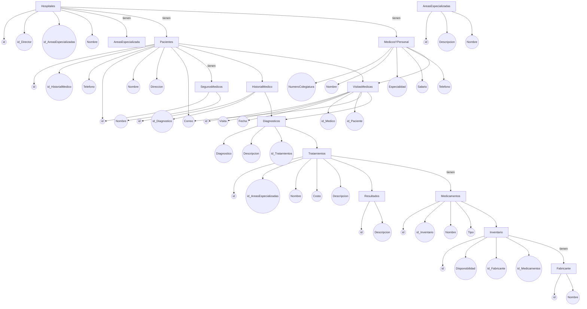
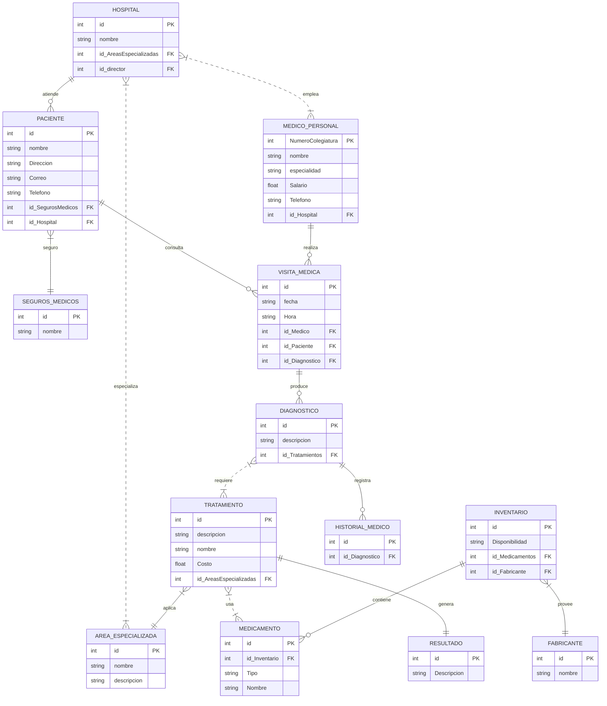

```mermaid
erDiagram
    HOSPITAL ||--o{ HOSPITAL_AREA : "tiene"
    HOSPITAL ||--o{ MEDICOYPERSONAL : "emplea"
    HOSPITAL ||--o{ PACIENTE : "atiende"
    
    HOSPITAL {
        int id PK
        string nombre
        int director_id FK
    }

    AREA_ESPECIALIZADA ||--o{ HOSPITAL_AREA : "pertenece"
    AREA_ESPECIALIZADA ||--o{ TRATAMIENTO_AREA : "permite"
    
    AREA_ESPECIALIZADA {
        int id PK
        string nombre
        string descripcion
    }

    HOSPITAL_AREA {
        int id PK
        int hospital_id FK
        int area_id FK
    }

    MEDICOYPERSONAL ||--o{ VISITA_MEDICA : "atiende"
    MEDICOYPERSONAL }|--|| ESPECIALIDAD : "tiene"
    
    MEDICOYPERSONAL {
        int numero_colegiatura PK
        string nombre
        float salario
        string telefono
        int hospital_id FK
        int especialidad_id FK
    }
    
    ESPECIALIDAD {
        int id PK
        string nombre
    }

    PACIENTE }|--|| SEGUROS_MEDICOS : "tiene"
    PACIENTE ||--o{ VISITA_MEDICA : "realiza"
    PACIENTE ||--o{ HISTORIAL_MEDICO : "posee"
    PACIENTE }|--|| DIRECCION : "reside_en"
    
    PACIENTE {
        int id PK
        string nombre
        string correo
        string telefono
        int seguro_medico_id FK
        int hospital_id FK
        int direccion_id FK
    }
    
    DIRECCION {
        int id PK
        string calle
        string ciudad
        string codigo_postal
    }

    SEGUROS_MEDICOS {
        int id PK
        string nombre
    }

    VISITA_MEDICA ||--o{ VISITA_DIAGNOSTICO : "genera"
    
    VISITA_MEDICA {
        int id PK
        date fecha
        time hora
        int medico_id FK
        int paciente_id FK
    }

    VISITA_DIAGNOSTICO {
        int visita_id FK
        int diagnostico_id FK
    }

    DIAGNOSTICO ||--o{ VISITA_DIAGNOSTICO : "pertenece"
    DIAGNOSTICO ||--o{ DIAGNOSTICO_TRATAMIENTO : "requiere"
    DIAGNOSTICO ||--o{ HISTORIAL_MEDICO : "registra"
    
    DIAGNOSTICO {
        int id PK
        string descripcion
    }

    DIAGNOSTICO_TRATAMIENTO {
        int id PK
        int diagnostico_id FK
        int tratamiento_id FK
    }

    TRATAMIENTO ||--o{ DIAGNOSTICO_TRATAMIENTO : "aplica"
    TRATAMIENTO ||--o{ TRATAMIENTO_AREA : "se_aplica_en"
    TRATAMIENTO ||--o{ TRATAMIENTO_MEDICAMENTO : "usa"
    TRATAMIENTO ||--o{ RESULTADO : "genera"
    TRATAMIENTO }|--|| TIPO_TRATAMIENTO : "es_de_tipo"
    
    TRATAMIENTO {
        int id PK
        string descripcion
        string nombre
        int tipo_tratamiento_id FK
    }
    
    TIPO_TRATAMIENTO {
        int id PK
        string nombre
        float costo_base
    }

    TRATAMIENTO_AREA {
        int id PK
        int tratamiento_id FK
        int area_id FK
    }

    TRATAMIENTO_MEDICAMENTO {
        int id PK
        int tratamiento_id FK
        int medicamento_id FK
    }

    MEDICAMENTO ||--o{ TRATAMIENTO_MEDICAMENTO : "es_usado_en"
    MEDICAMENTO }|--|| FABRICANTE : "fabricado_por"
    MEDICAMENTO ||--|| INVENTARIO : "tiene_stock"
    MEDICAMENTO }|--|| TIPO_MEDICAMENTO : "es_de_tipo"
    
    MEDICAMENTO {
        int id PK
        string nombre
        int fabricante_id FK
        int tipo_medicamento_id FK
    }
    
    TIPO_MEDICAMENTO {
        int id PK
        string nombre
    }

    FABRICANTE {
        int id PK
        string nombre
    }

    INVENTARIO }|--|| UBICACION : "en_ubicacion"
    
    INVENTARIO {
        int id PK
        int disponibilidad
        int medicamento_id FK
        int ubicacion_id FK
        date fecha_ingreso
    }
    
    UBICACION {
        int id PK
        string edificio
        string piso
        string estante
    }

    RESULTADO {
        int id PK
        string descripcion
        int tratamiento_id FK
    }

    HISTORIAL_MEDICO {
        int id PK
        int diagnostico_id FK
        int paciente_id FK
        date fecha_registro
    }
```

<h3 align="center";>

**SISTEMA HOSPITALARIO**

</h3>

<br>
<br>
<br>

<h3 align="center";>

**Maria Juliana Saavedra Mejia**

</h3>

<h3 align="center";>

**Juan David Santoyo Jaimes**

</h3>

<br>
<br>
<br>
<br>

<h3 align="center";>

**S1**

</h3>

<h3 align="center";>

**Pedro Felipe Gómez Bonilla**

</h3>

<br>
<br>
<br>
<br>

<h3 align="center";>

**CAMPUSLANDS**

</h3>

<h3 align="center";>

**RUTA NODE**

</h3>

<h3 align="center";>

**BUCARAMANGA, SANTANDER**

</h3>

<h3 align="center";>

**2025**

</h3>

---
<h1 align="center";>

# Introducción

</h1>

Este documento servirá como una guía detallada del proceso completo de diseño,
estructuración e implementación de una base de datos para un Sistema Hospitalario de la Secretaría de salud de Bucaramanga. El objetivo principal es gestionar eficazmente los datos e información generados por los hospitales, pacientes, médicos, tratamientos, medicamentos, visitas médicas, historiales clínicos, áreas especializadas y personal administrativo. Inicialmente, se analizará el caso de estudio junto con sus requerimientos específicos. A partir de esta investigación, se procederá a desarrollar un modelo conceptual detallado donde se identificarán las entidades principales, sus atributos y las relaciones entre ellas. Este paso determina las bases para comprender la estructura esencial de la gestión del sistema hospitalario.

A continuación, se realizará la conversión del modelo conceptual al modelo lógico. Este último
ofrece una representación más precisa de cómo se organizará la información, facilitando una
Comprensión clara de la base de datos en desarrollo. Se aplicará el proceso de Normalización
hasta la tercera forma normal (3FN) para optimizar la organización de los datos, reduciendo
redundancias y eliminando dependencias transitivas.

Posteriormente, se llevará a cabo la conversión del modelo lógico al modelo físico, el cual
define la implementación real de entidades, atributos y relaciones, incorporando detalles
técnicos como los tipos de datos adecuados para cada elemento.

Finalmente, se detallarán algunos procedimientos, funciones, consultas y creación perfiles que
complementarán la funcionalidad del sistema de información desarrollado, asegurando así su
eficiencia y utilidad para el sistema hospitalario.

Con estos pasos y elementos, se garantiza una guía completa y efectiva para el diseño y
desarrollo de la base de datos necesaria para la gestión eficiente del sistema hospitalario.


---
<h1 align="center";>

# Caso de Estudio

</h1>


La Secretaria de Salud ha pedido la creación de un diseño inicial de un software que permita manejar los datos e información que se generan sobre los Hospitales de la ciudad de Bucaramanga. Por lo que comenzamos estructurando los requerimientos dados:

- **Hospitales**

    - Un hospital puede tener múltiples áreas especializadas (Cardiología, Neurología, etc.).

    - Cada hospital tiene un director general, pero un director puede supervisar varios hospitales.
    - Cada hospital tiene un conjunto de médicos, enfermeras y personal administrativo.

    - Los hospitales deben contar con un historial detallado de pacientes y tratamientos realizados.

- **Pacientes**

    - Los pacientes se identifican por su número de historia clínica, nombre, dirección, teléfono, correo electrónico y seguros médicos.

    - Los historiales médicos incluyen diagnósticos, tratamientos realizados y resultados obtenidos.

- **Médicos y Personal**

    - Los médicos se identifican por su número de colegiatura, nombre, especialidad, teléfono, correo electrónico y salario.

    - Se definen los siguientes tipos de personal:

        - **001: Director General:** Gestión general del hospital.

        - **002: Médico Especialista:** Atiende pacientes y realiza diagnósticos.

        - **003: Enfermero/a:** Asiste a médicos y cuida a los pacientes.

        - **004: Personal Administrativo:** Gestión de recursos y logística.

        - **005: Personal de Mantenimiento:** Mantenimiento y limpieza de las instalaciones.

- **Tratamientos y Medicamentos**

    - Los tratamientos se identifican por su nombre, descripción, área médica relacionada y costo. 

    - Los medicamentos se almacenan por nombre, fabricante, tipo, y disponibilidad en inventario.

- **Visitas Médicas**

    - Las visitas médicas se registran con fecha, hora, médico asignado, paciente atendido y diagnóstico.

    - Los pacientes pueden tener múltiples visitas médicas a lo largo del tiempo.

Con base en la información anterior, se procederá a crear una base de datos en MongoDB con el objetivo de agrupar y relacionar los datos de los Hospitales de la ciudad de Bucaramanga, así como la información de los pacientes.

---
<h1 align="center";>

# Requisitos del Sistema

</h1>

Para ejecutar correctamente los scripts y configurar el sistema hospitalario, es necesario contar con el siguiente software instalado:

- MongoDB versión 4.x o superior

    -  Sitio oficial: https://www.mongodb.com/try/download/community

- MongoDB Compass (opcional, para visualización gráfica de datos)

    - Sitio oficial: https://www.mongodb.com/products/compass

- Git (para clonar el repositorio desde GitHub)

    - Sitio oficial: 
    https://github.com/Maria-Juliana-Saavedra-Mejia/Proyecto_MongoDB_S1_SaavedraMaria_SantoyoJuan

---

<h1 align="center";>

# Instalación y Configuración 

</h1>

Los archivos relacionados con la BBDD de la Secretaria de Salud , se encuentran en la
plataforma Github, estos archivos se encuentran en formato js y se dividen en 6 partes:

- ddl.js: Este archivo contiene el script para crear la base de datos y definir las colecciones correspondientes.

- dml.js: Este archivo contiene ejemplos de datos para gestionar los Hospitales, facilitando la inserción inicial de información.

- dql_select.js: En este archivo se encuentran las consultas relacionadas con pacientes, médicos, tratamientos, medicamentos, visitas médicas, historiales clínicos, áreas especializadas y personal administrativo.

- dql_funciones.js: Se definen los procedimientos y funciones para añadir, actualizar y mostrar datos dentro del sistema.

- Readme.md : Contiene toda la documentacion del proyecto. 

- Diagrama.jpg: En ese archivo se muestran los diagramas realizados. 

---


<h1 align="center";>

# Planificación 

</h1>

## Ejecución 

Una vez se analizó la información requerida por La Secretaria de Salud, se inició la creación del modelo conceptual. Este modelo proporciona una descripción de alto nivel de las necesidades de información que están detrás del diseño de una base de datos. Representa los conceptos principales de la base de datos y las relaciones entre ellos.

---


## Construcción del Modelo Conceptual

En esta sección del documento se adjunta la información correspondiente al modelo
conceptual el cual es el más abstracto de todos los modelos a implementar en el documento,
este es fundamental para identificar entidades clave del negocio y del sistema, así como para
establecer relaciones entre ellas.


**Descripción**

Se diseñó el modelo conceptual identificando cada una de las entidades, sus atributos y las
relaciones entre ellas. Este modelo conceptual proporciona una visión clara y estructurada de
cómo se organizan y conectan los diferentes elementos de la base de datos.

- **Las Entidades y Atributos**

1. Hospital

    - id: identificador único del hospital.
    - nombre: nombre del hospital.
    - id_AreasEspecializadas: Areas en las que se especializa
    - id_director: departamento correspondiente.

2. ÁreaEspecializada

    - id: identificador del área especializada.
    - nombre: nombre del área.
    - descripcion: descripción del área.

3. MédicoPersonal

    - NumeroColegiatura: identificador único del médico o personal.
    - nombre: nombre completo.
    - especialidad: especialidad médica.
    - Salario: Cantidad de dinero que gana mensualmente.
    - Teléfono: Numero de teléfono.

4. Paciente

    - id: identificador único del paciente.
    - nombre: nombre del paciente.
    - Dirección: Dirección.
    - Correo: correo electronico.
    - teléfono: teléfono de contacto.
    - id_SegurosMedicos: identificador del seguro del paciente.

5. SegurosMedicos

    - id: identificador único.
    - nombre: nombre del responsable.

6. VisitaMedica

    - id: identificador de la visita médica.
    - fecha: fecha de la visita.
    - Hora: hora de la visita.
    - id_Medico: identificador único del medico.
    - id_Paciente: identificador único del paciente.
    - id_Diagnostico: identificador único del paciente.

7. Diagnostico

    - id: identificador del diagnóstico.
    - descripcion: descripción del diagnóstico.
    - id_Tratamientos: identificador único de tratamientos.

8. Tratamientos

    - id: identificador del tratamiento.
    - descripcion: detalle del tratamiento.
    - nombre: duración estimada o real.
    - Costo: valor del tratamiento.
    - id_AreasEspecializadas: identificador del area del hospital que realiza este tratamiento.

9. Medicamentos

    - id: identificador del medicamento.
    - id_Inventario: Identificador del medicamento dentro del inventario.
    - Tipo: tipo de medicamento.
    - Nombre: nombre medicamento.

10. Inventario

    - id: identificador del inventario.
    - Disponibilidad: Cantidad de medicamentos en stock.
    - id_Medicamentos: identificador unico de los medicamentos dentro del inventario.
    - id_Fabricante:identificador unico de los fabricantes de los medicamentos.

11. Fabricante

    - id: identificador del fabricante.
nombre: nombre del fabricante.

12. Resultado

    - id: identificador del resultado.
    - Descripcion: descripcion del resultado obtenido en el tratamiento.

13. HistorialMedico

    - id: identificador HistorialMedico.
    - id_Diagnostico: nombre de la entidad.

- **Relaciones y Cardinalidades**

1. Hospital – MédicoPersonal

Cardinalidad:

Un hospital tiene uno o muchos médicos.
Un médico trabaja en muchos hospitales.
(N:M)

2. Hospital – ÁreaEspecializada

Cardinalidad:

Un hospital tiene una o varias áreas especializadas.
Un área especializada pertenece a un muchos hospitales.
(N:M)

3. Hospital – Paciente

Cardinalidad:

Un hospital atiende a uno o varios pacientes.
Un paciente es atendido por un solo hospital.
(1:N)

4. Paciente – SegurosMedicos

Cardinalidad:

Un paciente tiene un solo seguro médico.
Un seguro médico puede estar asociado a varios pacientes.
(N:1)

5. Paciente – VisitaMedica

Cardinalidad:

Un paciente puede tener muchas visitas médicas.
Cada visita médica está asociada a un solo paciente.
(1:N)

6. MédicoPersonal – VisitaMedica

Cardinalidad:

Un médico puede realizar muchas visitas médicas.
Cada visita médica es atendida por un solo médico.
(1:N)

7. VisitaMedica – Diagnóstico

Cardinalidad:

Una visita médica puede generar uno o varios diagnósticos.
Cada diagnóstico proviene de una única visita médica.
(1:N)

8. Diagnóstico – Tratamientos

Cardinalidad:

Un diagnóstico puede requerir varios tratamientos.
Un tratamiento puede ser aplicado a varios diagnósticos.
(N:M)

9. Tratamiento – ÁreaEspecializada

Cardinalidad:

Un tratamiento es aplicado por una sola área especializada.
Un área especializada puede realizar varios tratamientos.
(1:N)

10. Tratamiento – Medicamentos

Cardinalidad:

Un tratamiento puede usar varios medicamentos.
Un medicamento puede usarse en varios tratamientos.
(N:M)

11. Medicamento – Inventario

Cardinalidad:

Un medicamento está en un inventario.
Un inventario puede contener muchos medicamentos.
(1:N)

12. Inventario – Fabricante

Cardinalidad:

Un fabricante puede proveer muchos medicamentos al inventario.
Un inventario puede registrar medicamentos de un solo fabricante.
(1:N)

13. Tratamiento – Resultado

Cardinalidad:

Un tratamiento puede generar un resultado.
Un resultado está ligado a un tratamiento.
(1:1)

14. Diagnóstico – HistorialMedico

Cardinalidad:

Un diagnóstico forma parte del historial médico.
Un historial médico puede contener muchos diagnósticos.
(1:N)

**Diagrama** 



## Construcción del Modelo Lógico

En esta sección del documento se adjunta la información correspondiente al modelo lógico el
cual es el representa la estructura de los datos sin detalles de implementación física,
enfocándose en las entidades, atributos, relaciones y claves de la base de datos.Este modelo
ayuda a comprender la organización de los datos y sus interconexiones, permitiendo la
normalización y la especificación de claves principales y externas.


**Descripción**

- **Las Entidades y Atributos**

1. Hospital 
    - id: INT PRIMARY KEY.
    - id_director: INT NOT NULL FOREING KEY.
    - id_AreasEspecializadas: INT NOT NULL FOREING KEY.
    - nombre: String (100) NOT NULL.

2. AreasEspecializadas
   - id: INT PRIMARY KEY.
   - nombre: String (100) NOT NULL.
   - descripcion: String (500) NOT NULL.

3. Medico_Personal 
    - NumeroColegiatura: INT PRIMARY KEY.
    - nombre: String (100) NOT NULL.
    - especialidad: String (100) NOT NULL.
    - salario: Double NOT NULL.
    - telefono: String (25) NOT NULL.
    - id_Hospital: INT NOT NULL FOREING KEY.

4. Paciente
    - id: INT PRIMARY KEY.
    - nombre: String (100) NOT NULL.
    - direccion: String (100) NOT NULL.
    - correo: String (100) NOT NULL.
    - telefono: String (25) NOT NULL
    - id_SegurosMedicos: INT NOT NULL FOREING KEY.
    - id_Hospital: INT NOT NULL FOREING KEY.


5. SegurosMedicos
    - id: INT PRIMARY KEY.
    - nombre: String (100) NOT NULL.

6. HistorialMedico
    - id: INT PRIMARY KEY.
    - id_Diagnostico: INT NOT NULL FOREING KEY.

7. VisitasMedicas
    - id: INT PRIMARY KEY.
    - fecha: Date NOT NULL.
    - id_Medico: INT NOT NULL FOREING KEY.
    - id_Paciente: INT NOT NULL FOREING KEY.
    - id_Diagnostico: INT NOT NULL FOREING KEY.

8. Diagnosticos
    - id: INT PRIMARY KEY.
    - descripcion: String (500) NOT NULL.
    - id_Tratamientos: INT NOT NULL FOREING KEY.

9. Tratamientos
    - id: INT PRIMARY KEY.
    - descripcion: String (500) NOT NULL.
    - nombre: String (100) NOT NULL.
    - Costo: Double NOT NULL.
    - id_AreasEspecializadas: INT NOT NULL FOREING KEY.

10. Resultados
    - id: INT PRIMARY KEY.
    - descripcion: String (500) NOT NULL.

11. Medicamentos
    - id: INT PRIMARY KEY.
    - id_Inventario: INT NOT NULL FOREING KEY.
    - tipo: String (100) NOT NULL.
    - nombre: String (100) NOT NULL.

12. Inventario
    - id: INT PRIMARY KEY.
    - Disponibilidad: INT NOT NULL.
    - id_Medicamentos: INT NOT NULL FOREING KEY.
    - id_Fabricante: INT NOT NULL FOREING KEY.

13. Fabricante
    - id: INT PRIMARY KEY.
    - nombre: String (100) NOT NULL.

- **Relaciones y Cardinalidades**

1. Hospital - Médico Personal:

    - Un hospital puede emplear a varios médicos, y un médico puede trabajar en varios hospitales.

    - Relación N:M (muchos a muchos)

2. Hospital - Área Especializada:

    - Un hospital puede tener varias áreas especializadas, y una misma área puede estar presente en varios hospitales.

    - Relación N:M (muchos a muchos)

3. Hospital - Paciente:

    - Un hospital atiende a muchos pacientes, pero un paciente solo es atendido en un hospital.

    - Relación 1:N (uno a muchos)

4. Paciente - Seguros Médicos:

    - Cada paciente tiene un solo seguro médico, pero un seguro médico puede ser compartido por varios pacientes.

    - Relación N:1 (muchos a uno)

5. Paciente - Visita Médica:

    - Un paciente puede tener múltiples visitas médicas, pero cada visita médica está asociada a un solo paciente.

    - Relación 1:N (uno a muchos)

6. Médico Personal - Visita Médica:

    - Un médico puede realizar muchas visitas médicas, pero cada visita médica es realizada por un único médico.

    - Relación 1:N (uno a muchos)

7. Visita Médica - Diagnóstico:

    - Una visita médica puede generar varios diagnósticos, pero cada diagnóstico está ligado a una única visita.

    - Relación 1:N (uno a muchos)

8. Diagnóstico - Tratamiento:

    - Un diagnóstico puede requerir varios tratamientos, y un tratamiento puede ser usado en distintos diagnósticos.

    - Relación N:M (muchos a muchos)

9. Tratamiento - Área Especializada:

    - Un tratamiento se aplica en una única área especializada, pero una misma área puede aplicar varios tratamientos.

    - Relación N:1 (muchos a uno)

10. Tratamiento - Medicamento:

    - Un tratamiento puede usar varios medicamentos, y un medicamento puede ser usado en múltiples tratamientos.

    - Relación N:M (muchos a muchos)

11. Inventario - Medicamento:

    - Un inventario puede contener varios medicamentos, pero un medicamento está en un solo inventario.

    - Relación 1:N (uno a muchos)

12. Inventario - Fabricante:

    - Cada inventario está abastecido por un fabricante, pero un fabricante puede proveer varios inventarios.

    - Relación N:1 (muchos a uno)

13. Tratamiento - Resultado:

    - Cada tratamiento genera un único resultado, y un resultado es generado por un único tratamiento.

    - Relación 1:1 (uno a uno)

14. Diagnóstico - Historial Médico:

    - Un diagnóstico puede registrarse en varios historiales médicos, pero un historial médico solo tiene un diagnóstico.

    - Relación 1:N (uno a muchos)


**Diagrama**


## Normalización del Modelo Lógico

En esta sección del documento se adjunta la normalización realizada al modelo lógico, es un
proceso para organizar los datos de forma eficiente y coherente, eliminando la redundancia y
las inconsistencias. Este proceso se enfoca en estructurar las tablas de la base de datos
según reglas específicas, conocidas como formas normales, para mejorar la integridad de los
datos y facilitar su manipulación.

## Primera Forma Normal (1FN)

En esta sección del documento se adjunta la información correspondiente a la primera forma
de normalización que implica que cada celda de una tabla contenga un único valor atómico, es
decir, que no pueda ser dividido en partes más pequeñas. Además, la tabla debe tener una
clave primaria única que identifique cada fila de forma inequívoca.

**Descripción**

Una tabla está en 1FN si cumple con los siguientes criterios:

-  Todos los atributos contienen valores atómicos (indivisibles).

- No debe haber grupos repetitivos de columnas.

- Cada columna debe contener un solo valor en cada fila.


**Descripción Técnica**
   
1. Hospital :

     Se encuentra en 1FN, ya que cuenta con una clave primaria única (id) y cada columna tiene valores atómicos, únicos y no repetitivos.

2. area_especializada :

    Se encuentra en 1FN, ya que cuenta con una clave primaria (id) y los atributos contienen valores atómicos y no multivaluados.

3. hospital_area :

    Se encuentra en 1FN, ya que está compuesta por claves foráneas (hospital_id, area_id) que juntas forman una clave primaria compuesta, sin repetición y con datos atómicos.

4. medico_personal :

    Se encuentra en 1FN, ya que su clave primaria (numero_colegiatura) identifica de forma única a cada médico y sus columnas contienen valores no repetitivos y atómicos.

5. paciente : 

    Se encuentra en 1FN, con una clave primaria (id) única y columnas que no contienen grupos repetitivos ni valores múltiples.

6. seguros_medicos :

    Se encuentra en 1FN, ya que su identificador (id) es único y cada atributo tiene un valor atómico y no repetitivo.

7. visita_medica :

    Se encuentra en 1FN, al tener una clave primaria (id) única, y sus columnas son todas atómicas (como fecha, hora, etc.).

8. diagnostico :

    Se encuentra en 1FN, ya que el campo id es la clave primaria, y no existen atributos multivaluados o compuestos.

9. visita_diagnostico :

    Se encuentra en 1FN, al contar con una clave compuesta (visita_id, diagnostico_id) y columnas con valores no repetitivos.

10. tratamiento :

    Se encuentra en 1FN, ya que tiene una clave primaria (id) y valores únicos y atómicos por cada atributo.

11. diagnostico_tratamiento :

    Se encuentra en 1FN, al tener una clave compuesta (diagnostico_id, tratamiento_id) sin duplicados y con datos no multivaluados.

12. medicamento :

    Se encuentra en 1FN, ya que cuenta con una clave primaria (id) y cada columna contiene un solo valor por fila.

13. tratamiento_medicamento :

    Se encuentra en 1FN, con clave compuesta entre tratamiento_id y medicamento_id, sin datos multivaluados ni repetidos.

14. fabricante :

    Se encuentra en 1FN, ya que su clave primaria (id) garantiza unicidad y sus columnas son simples y atómicas.

15. inventario :

    Se encuentra en 1FN, ya que tiene un identificador único (id) y no existen valores repetitivos o multivaluados en sus columnas.

16. tratamiento_area : 

    Se encuentra en 1FN, con clave compuesta entre tratamiento_id y area_id, y columnas atómicas y sin redundancia.

17. resultado :

    Se encuentra en 1FN, ya que su clave primaria (id) es única y todos los atributos contienen valores atómicos.

18. historial_medico :

    Se encuentra en 1FN, ya que su clave (id) es única, y los datos no se repiten ni están agrupados en conjuntos o listas.


**Diagrama**


## Segunda Forma Normal (2FN)

En esta sección del documento se adjunta la información correspondiente a la Segunda Forma
Normal (2FN), un paso crucial en el proceso de normalización de bases de datos. La 2FN se
enfoca en resolver un problema específico que puede surgir cuando se trabaja con claves
primarias compuestas, es decir, cuando una clave primaria está formada por dos o más
atributos. El objetivo principal de esta segunda forma es eliminar las dependencias parciales
entre los atributos no clave y la clave primaria.

**Descripción**

Una tabla está en 2FN si cumple con los siguientes criterios:

- Está en 1FN.

- Todos los atributos no clave (no pertenecientes a una clave primaria compuesta)
dependen completamente de la clave primaria.

**Descripción Técnica**

1. hospital :

    Se encuentra en 2FN, ya que cuenta con una clave primaria única (id) y cada columna depende completamente de esta clave primaria, sin dependencias parciales.

2. area_especializada :

    Se encuentra en 2FN, ya que cuenta con una clave primaria única (id) y todos los atributos (nombre, descripcion) dependen completamente de ella.

3. hospital_area :

    Se encuentra en 2FN, ya que su clave compuesta (hospital_id, area_id) no tiene dependencias parciales: ambas columnas representan la totalidad de la clave, y no hay atributos adicionales.

4. medico_personal :

    Se encuentra en 2FN, ya que todos los atributos (nombre, especialidad, salario, telefono, hospital_id) dependen por completo del identificador único (numero_colegiatura).

5. paciente :

    Se encuentra en 2FN, dado que los atributos (nombre, direccion, correo, telefono, seguro_medico_id, hospital_id) dependen exclusivamente del identificador (id), sin dependencias parciales.

6. seguros_medicos :

    Se encuentra en 2FN, ya que su atributo nombre depende completamente de su clave primaria (id).

7. visita_medica :

    Se encuentra en 2FN, ya que todos los atributos (fecha, hora, medico_id, paciente_id) dependen directamente de la clave primaria (id).

8. diagnostico :

    Se encuentra en 2FN, porque descripcion depende directamente de la clave primaria (id).

9. visita_diagnostico :

    Se encuentra en 2FN, ya que su clave está compuesta (visita_id, diagnostico_id) y no hay atributos adicionales que dependan parcialmente de una sola parte de la clave.

10. tratamiento :

    Se encuentra en 2FN, ya que los atributos (descripcion, nombre, costo) dependen completamente de su clave primaria (id).

11. diagnostico_tratamiento :

    Se encuentra en 2FN, ya que todos los atributos dependen completamente de la clave compuesta (diagnostico_id, tratamiento_id).

12. medicamento :

    Se encuentra en 2FN, porque los atributos (tipo, nombre, fabricante_id) dependen directamente de la clave primaria (id), sin dependencias parciales.

13. tratamiento_medicamento :

    Se encuentra en 2FN, ya que tiene clave compuesta (tratamiento_id, medicamento_id) sin atributos adicionales y, por tanto, sin dependencias parciales.

14. fabricante :

    Se encuentra en 2FN, ya que nombre depende completamente del identificador único (id).

15. inventario : 

    Se encuentra en 2FN, dado que todos los atributos (disponibilidad, medicamento_id, ubicacion, fecha_ingreso) dependen totalmente del identificador (id).

16. tratamiento_area :

    Se encuentra en 2FN, ya que la clave compuesta (tratamiento_id, area_id) no tiene atributos adicionales que generen dependencias parciales.

17. resultado : 

    Se encuentra en 2FN, porque tanto descripcion como tratamiento_id dependen de la clave primaria (id) sin ambigüedad.

18. historial_medico :

    Se encuentra en 2FN, ya que los atributos (diagnostico_id, paciente_id, fecha_registro) dependen completamente del identificador (id).

**Diagrama**


```mermaid
erDiagram
    HOSPITAL {
        int id PK
        string nombre
        int director_id FK
    }
    
    AREA_ESPECIALIZADA {
        int id PK
        string nombre
        string descripcion
    }
    
    HOSPITAL_AREA {
        int hospital_id FK
        int area_id FK
    }
    
    MEDICO_PERSONAL {
        int numero_colegiatura PK
        string nombre
        string especialidad
        float salario
        string telefono
        int hospital_id FK
    }
    
    PACIENTE {
        int id PK
        string nombre
        string direccion
        string correo
        string telefono
        int seguro_medico_id FK
        int hospital_id FK
    }
    
    SEGUROS_MEDICOS {
        int id PK
        string nombre
    }
    
    VISITA_MEDICA {
        int id PK
        date fecha
        time hora
        int medico_id FK
        int paciente_id FK
    }
    
    DIAGNOSTICO {
        int id PK
        string descripcion
    }
    
    VISITA_DIAGNOSTICO {
        int visita_id FK
        int diagnostico_id FK
    }
    
    TRATAMIENTO {
        int id PK
        string descripcion
        string nombre
        float costo
    }
    
    DIAGNOSTICO_TRATAMIENTO {
        int diagnostico_id FK
        int tratamiento_id FK
    }
    
    MEDICAMENTO {
        int id PK
        string tipo
        string nombre
        int fabricante_id FK
    }
    
    TRATAMIENTO_MEDICAMENTO {
        int tratamiento_id FK
        int medicamento_id FK
    }
    
    FABRICANTE {
        int id PK
        string nombre
    }
    
    INVENTARIO {
        int id PK
        int disponibilidad
        int medicamento_id FK
        string ubicacion
        date fecha_ingreso
    }
    
    TRATAMIENTO_AREA {
        int tratamiento_id FK
        int area_id FK
    }
    
    RESULTADO {
        int id PK
        string descripcion
        int tratamiento_id FK
    }
    
    HISTORIAL_MEDICO {
        int id PK
        int diagnostico_id FK
        int paciente_id FK
        date fecha_registro
    }

    %% Relaciones
    HOSPITAL ||--o{ HOSPITAL_AREA : "tiene"
    AREA_ESPECIALIZADA ||--o{ HOSPITAL_AREA : "pertenece"
    HOSPITAL ||--o{ MEDICO_PERSONAL : "emplea"
    HOSPITAL ||--o{ PACIENTE : "atiende"
    PACIENTE }|--|| SEGUROS_MEDICOS : "tiene"
    PACIENTE ||--o{ VISITA_MEDICA : "realiza"
    MEDICO_PERSONAL ||--o{ VISITA_MEDICA : "atiende"
    VISITA_MEDICA ||--o{ VISITA_DIAGNOSTICO : "genera"
    DIAGNOSTICO ||--o{ VISITA_DIAGNOSTICO : "pertenece"
    DIAGNOSTICO ||--o{ DIAGNOSTICO_TRATAMIENTO : "requiere"
    TRATAMIENTO ||--o{ DIAGNOSTICO_TRATAMIENTO : "aplica"
    TRATAMIENTO ||--o{ TRATAMIENTO_AREA : "se_aplica_en"
    AREA_ESPECIALIZADA ||--o{ TRATAMIENTO_AREA : "permite"
    TRATAMIENTO ||--o{ TRATAMIENTO_MEDICAMENTO : "usa"
    MEDICAMENTO ||--o{ TRATAMIENTO_MEDICAMENTO : "es_usado_en"
    MEDICAMENTO }|--|| FABRICANTE : "fabricado_por"
    MEDICAMENTO ||--|| INVENTARIO : "tiene_stock"
    TRATAMIENTO ||--o{ RESULTADO : "genera"
    DIAGNOSTICO ||--o{ HISTORIAL_MEDICO : "registra"
    PACIENTE ||--o{ HISTORIAL_MEDICO : "posee"
```

## Tercera Forma Normal (3FN)

En esta sección del documento se adjunta la información correspondiente a la Tercera Forma
Normal (3FN), un paso crucial en el proceso de normalización de bases de datos. Su objetivo
principal es eliminar las dependencias transitivas, lo que significa que ningún atributo no clave
puede depender directamente de la clave primaria a través de otro atributo no clave. Esto
garantiza que cada columna no clave esté directamente vinculada a la clave primaria y nada
más.

**Descripción**

Una tabla está en 3NF si cumple con los siguientes criterios:

- Está en 2NF.

- No hay dependencias transitivas: ningún atributo no clave depende de otro atributo no
clave.

**Descripción Técnica**

1. hospital :

    Se encuentra en 3FN, ya que está en 2FN y en cada columna no hay dependencias transitivas con la clave primaria (id).
    
2. area_especializada :

    Se encuentra en 3FN, ya que todos sus atributos (nombre, descripcion) dependen únicamente de la clave primaria (id), sin dependencias transitivas.
    
3. hospital_area :

    Se encuentra en 3FN, ya que está en 2FN, no tiene atributos adicionales y no existen dependencias transitivas entre sus claves foráneas.

4. medico :

    Se encuentra en 3FN, ya que sus atributos (nombre, salario, telefono, hospital_id, especialidad_id) dependen directamente de la clave primaria (numero_colegiatura) y no hay dependencia transitiva.

5. especialidad :

    Se encuentra en 3FN, ya que nombre depende directamente de su clave (id) y no existen otras dependencias.

6. paciente :

    Se encuentra en 3FN, ya que los atributos (nombre, correo, telefono, seguro_medico_id, hospital_id, direccion_id) dependen solo de la clave primaria (id) y no de otros atributos entre sí.

7. direccion :

    Se encuentra en 3FN, porque calle, ciudad y codigo_postal dependen directamente de id, sin relaciones transitivas.

8. seguros_medicos :

    Se encuentra en 3FN, ya que nombre depende solo de la clave primaria (id).

9. visita_medica :

    Se encuentra en 3FN, dado que todos sus atributos (fecha, hora, medico_id, paciente_id) dependen directamente de la clave (id).

10. visita_diagnostico :

    Se encuentra en 3FN, ya que está en 2FN, no tiene atributos adicionales y no hay dependencia transitiva entre las claves.

11. diagnostico :

    Se encuentra en 3FN, dado que descripcion depende directamente de la clave primaria (id).

12. diagnostico_tratamiento :

    Se encuentra en 3FN, ya que su clave compuesta (diagnostico_id, tratamiento_id) no tiene atributos adicionales ni dependencias transitivas.

13. tratamiento :

    Se encuentra en 3FN, ya que los atributos (descripcion, nombre, tipo_tratamiento_id) dependen directamente de la clave (id) y no hay dependencia entre atributos no clave.

14. tipo_tratamiento :

    Se encuentra en 3FN, ya que nombre y costo_base dependen solo de id, sin dependencias transitivas.

15. tratamiento_area :

    Se encuentra en 3FN, ya que no tiene atributos adicionales y ambas claves foráneas forman su clave compuesta, sin dependencias transitivas.

16. tratamiento_medicamento :

    Se encuentra en 3FN, ya que ambas columnas (tratamiento_id, medicamento_id) forman la clave compuesta y no hay más atributos ni dependencias.

17. medicamento :

    Se encuentra en 3FN, ya que los atributos (nombre, fabricante_id, tipo_medicamento_id) dependen únicamente de la clave primaria (id), sin relaciones transitivas entre ellos.

18. tipo_medicamento :

    Se encuentra en 3FN, ya que su atributo nombre depende directamente de su clave primaria (id).

19. fabricante :

    Se encuentra en 3FN, ya que nombre depende únicamente de id, sin otras dependencias.
    
20. inventario :

    Se encuentra en 3FN, ya que todos los atributos (disponibilidad, medicamento_id, ubicacion_id, fecha_ingreso) dependen solo de id, sin dependencia transitiva entre ellos.

21. ubicacion :

    Se encuentra en 3FN, ya que edificio, piso y estante dependen únicamente del identificador (id).

22. resultado :

    Se encuentra en 3FN, ya que sus atributos (descripcion, tratamiento_id) dependen de la clave (id) y no de otras columnas.

23. historial_medico :

    Se encuentra en 3FN, ya que los campos (diagnostico_id, paciente_id, fecha_registro) dependen directamente del identificador único (id) y no de otros campos.


**Diagrama**

---

## Construcción del Modelo Físico

En esta sección del documento se adjunta el modelo físico realizado, el cual , describe la
estructura real de la base de datos, incluyendo detalles como las tablas, columnas, tipos de
datos, restricciones y relaciones entre tablas. Es el último paso en el proceso de modelado de
datos, después del modelo lógico, y se utiliza para generar la estructura física de la base de
datos en un sistema de gestión de bases de datos (DBMS).

**Descripción**

En el codigo que se puede ver a continuación se encuentra el modelo físico para el SISTEMA HOSPITALARIO. Este modelo representa la estructura detallada de la base de datos, diseñada para
almacenar y gestionar eficientemente la información relacionada con los hospitales, pacientes, medicamentos, historias medicas personal del hospital. Cada tabla está definida
con sus respectivos atributos, tipos de datos y restricciones, incluyendo claves primarias y
claves foráneas que garantizan la integridad y coherencia de los datos.

- Para Crear y usar la base Base de Datos se utiliza el siguiente comando: 

```
use Sistema_Hospitalario
```

- Creacion de las colecciones 

comenzaremos creando las colecciones junto a sus tipos de datos correspondientes. Para esto usar los siguientes comandos. 

1. Creacion de la coleccion Hospital.

    - _id: int (PK)

    - nombre: string

    - director_id: int (FK)


```
db.createCollection("Hospital", {
  validator: {
    $jsonSchema: {
      bsonType: "object",
      required: ["_id", "nombre", "director_id"],
      properties: {
        _id: { bsonType: "int" }, 
        nombre: { bsonType: "string" },
        director_id: { bsonType: "string" }
      }
    }
  }
});
```
2. Creacion de la coleccion Hospital_Area.

    - _id: int (PK)

    - area_id: int (FK)

    - director_id: int (FK)

```
db.createCollection("Hospital_Area", {
  validator: {
    $jsonSchema: {
      bsonType: "object",
      required: ["_id", "area_id"],
      properties: {
        _id: { bsonType: "int" }, 
        area_id: { bsonType: "int" }, 
        director_id: { bsonType: "int" }
      }
    }
  }
});
```
3. Creacion de la coleccion Area_Especializada.

    - _id: int (PK)

    - nombre: string

    - descripcion: string

```
db.createCollection("Area_Especializada", {
  validator: {
    $jsonSchema: {
      bsonType: "object",
      required: ["_id", "nombre", "descripcion"],
      properties: {
        _id: { bsonType: "int" }, 
        nombre: { bsonType: "string" },
        descripcion: { bsonType: "string" }
      }
    }
  }
});
```
4. Creacion de la coleccion MedicosYPersonal.

    - numero_colegiatura: int (PK)

    - nombre: string

    - salario: double

    - telefono: string

    - hospital_id: int (FK)

    - especialidad_id: int (FK)

```
db.createCollection("MedicosYPersonal", {
  validator: {
    $jsonSchema: {
      bsonType: "object",
      required: ["numero_colegiatura", "nombre", "salario", "telefono", "hospital_id", "especialidad_id" ],
      properties: {
        numero_colegiatura: { bsonType: "string" }, 
        nombre: { bsonType: "string" },
        salario: { bsonType: "double" },
        telefono: { bsonType: "string" },
        hospital_id:{ bsonType: "int" },
        especialidad_id:{ bsonType: "int" }, 
      }
    }
  }
});
```
5. Creacion de la coleccion Paciente.

    - _id: int (PK)

    - nombre: string

    - correo: string

    - telefono: string

    - hospital_id: int (FK)

    - especialidad_id: int (FK)

    - seguro_medico_id: int (FK)

    - direccion_id: int (FK)

```
db.createCollection("Paciente", {
  validator: {
    $jsonSchema: {
      bsonType: "object",
      required: ["_id", "nombre", "correo", "telefono", "hospital_id", "especialidad_id","seguro_medico_id" ],
      properties: {
        _id: { bsonType: "int" }, 
        nombre: { bsonType: "string" },
        correo: { bsonType: "string" },
        telefono: { bsonType: "string" },
        hospital_id:{ bsonType: "int" },
        seguro_medico_id:{ bsonType: "int" }, 
        direccion_id:{ bsonType: "int" }
      }
    }
  }
});
```
6. Creacion de la coleccion Especialidad.

    - _id: int (PK)

    - nombre: string

```
db.createCollection("Especialidad", {
  validator: {
    $jsonSchema: {
      bsonType: "object",
      required: ["_id", "nombre"],
      properties: {
        _id: { bsonType: "int" }, 
        nombre: { bsonType: "string" }
      }
    }
  }
});

```
7. Creacion de la coleccion Seguros_Medicos.

    - _id: int (PK)

    - nombre: string

```

db.createCollection("Seguros_Medicos", {
  validator: {
    $jsonSchema: {
      bsonType: "object",
      required: ["_id", "nombre"],
      properties: {
        _id: { bsonType: "int" }, 
        nombre: { bsonType: "string" }
      }
    }
  }
});
```
8. Creacion de la coleccion Direccion.

    - _id: int (PK)

    - calle: string

    - ciudad: string

    - codigo_postal: string

```
db.createCollection("Direccion", {
  validator: {
    $jsonSchema: {
      bsonType: "object",
      required: ["_id", "calle", "ciudad", "codigo_postal" ],
      properties: {
        _id: { bsonType: "int" }, 
        calle: { bsonType: "string" },
        ciudad: { bsonType: "string" },
        codigo_postal: { bsonType: "string" }
      }
    }
  }
});
```
9. Creacion de la coleccion Visita_Medica.

    - _id: int (PK)

    - fecha: date

    - hora: string

    - medico_id: int (FK)

    - paciente_id: int (FK)

```
db.createCollection("Visita_Medica", {
  validator: {
    $jsonSchema: {
      bsonType: "object",
      required: ["_id", "fecha", "hora", "medico_id", "paciente_id"],
      properties: {
        _id: { bsonType: "int" },
        fecha: { bsonType: "date" },
        hora: {
          bsonType: "string",
          pattern: "^([0-1]?[0-9]|2[0-3]):[0-5][0-9]$"
        },
        medico_id: { bsonType: "string" },
        paciente_id: { bsonType: "int" }
      }
    }
  }
});
```
10. Creacion de la coleccion Historial_Medico.

    - _id: int (PK)

    - diagnostico_id: int (FK)

    - paciente_id: int (FK)

    - fecha_registro: date

```
db.createCollection("Historial_Medico", {
  validator: {
    $jsonSchema: {
      bsonType: "object",
      required: ["_id", "diagnostico_id", "paciente_id", "fecha_registro" ],
      properties: {
        _id: { bsonType: "int" }, 
        diagnostico_id: { bsonType: "int" },
        paciente_id: { bsonType: "int" },
        fecha_registro: { bsonType: "date" }
      }
    }
  }
});
```
11. Creacion de la coleccion Diagnostico. 

    - _id: int (PK)

    - descripcion: string

```
db.createCollection("Diagnostico", {
  validator: {
    $jsonSchema: {
      bsonType: "object",
      required: ["_id", "descripcion" ],
      properties: {
        _id: { bsonType: "int" }, 
        descripcion: { bsonType: "string" }
      }
    }
  }
});
```
12. Creacion de la coleccion Tratamiento_Area.

    - _id: int (PK)

    - tratamiento_id: int (FK)

    - area_id: int (FK)

```
db.createCollection("Tratamiento_Area", {
  validator: {
    $jsonSchema: {
      bsonType: "object",
      required: ["_id", "tratamiento_id", "area_id" ],
      properties: {
        _id: { bsonType: "int" }, 
        tratamiento_id: { bsonType: "int" },
        area_id: { bsonType: "int" }
      }
    }
  }
});
```
13. Creacion de la coleccion Tratamiento_Medicamento.

    - _id: int (PK)

    - tratamiento_id: int (FK)

    - medicamento_id: int (FK)

```
db.createCollection("Tratamiento_Medicamento", {
  validator: {
    $jsonSchema: {
      bsonType: "object",
      required: ["_id", "tratamiento_id", "medicamento_id"],
      properties: {
        _id: { bsonType: "int" }, 
        tratamiento_id: { bsonType: "int" },
        medicamento_id: { bsonType: "int" }
      }
    }
  }
});
```
14. Creacion de la coleccion Tratamiento.

    - _id: int (PK)

    - nombre: string

    - descripcion: string

    - tipo_tratamiento_id: int (FK)

```
db.createCollection("Tratamiento", {
  validator: {
    $jsonSchema: {
      bsonType: "object",
      required: ["_id", "descripcion", "nombre", "tipo_tratamiento_id"],
      properties: {
        _id: { bsonType: "int" }, 
        nombre: { bsonType: "string" },
        descripcion: { bsonType: "string" },
        tipo_tratamiento_id: { bsonType: "int" }
      }
    }
  }
});
```
15. Creacion de la coleccion Resultado. 

    - _id: int (PK)

    - descripcion: string

    - tratamiento_id: int (FK)

```
db.createCollection("Resultado", {
  validator: {
    $jsonSchema: {
      bsonType: "object",
      required: ["_id", "descripcion", "tratamiento_id"],
      properties: {
        _id: { bsonType: "int" }, 
        descripcion: { bsonType: "string" },
        tratamiento_id: { bsonType: "int" }
      }
    }
  }
});
```
16. Creacion de la coleccion Tipo_Tratamiento.

    - _id: int (PK)

    - nombre: string

    - costo_base: double

```
db.createCollection("Tipo_Tratamiento", {
  validator: {
    $jsonSchema: {
      bsonType: "object",
      required: ["_id", "nombre", "costo_base"],
      properties: {
        _id: { bsonType: "int" }, 
        nombre: { bsonType: "string" },
        costo_base: { bsonType: "double" }
      }
    }
  }
});
```
17. Creacion de la coleccion Medicamento.

    - _id: int (PK)

    - nombre: string

    - fabricante_id: int (FK)

    - tipo_medicamento_id: int (FK)

```
db.createCollection("Medicamento", {
  validator: {
    $jsonSchema: {
      bsonType: "object",
      required: ["_id", "nombre", "fabricante_id","tipo_medicamento_id"],
      properties: {
        _id: { bsonType: "int" }, 
        nombre: { bsonType: "string" },
        fabricante_id: { bsonType: "int" }, 
        tipo_medicamento_id: { bsonType: "int" }
      }
    }
  }
});
```
18. Creacion de la coleccion Fabricante. 

    - _id: int (PK)

    - nombre: string

```
db.createCollection("Fabricante", {
  validator: {
    $jsonSchema: {
      bsonType: "object",
      required: ["_id", "nombre"],
      properties: {
        _id: { bsonType: "int" }, 
        nombre: { bsonType: "string" }
      }
    }
  }
});
```
19. Creacion de la coleccion Tipo_Medicamento.

    - _id: int (PK)

    - nombre: string


```
db.createCollection("Tipo_Medicamento", {
  validator: {
    $jsonSchema: {
      bsonType: "object",
      required: ["_id", "nombre"],
      properties: {
        _id: { bsonType: "int" }, 
        nombre: { bsonType: "string" }
      }
    }
  }
});
```
20. Creacion de la coleccion Inventario.

    - _id: int (PK)

    - disponibilidad: int

    - medicamento_id: int (FK)

    - ubicacion_id: int (FK)

    - fecha_ingreso: date

```
db.createCollection("Inventario", {
  validator: {
    $jsonSchema: {
      bsonType: "object",
      required: ["_id", "disponibilidad", "medicamento_id","ubicacion_id","fecha_ingreso"],
      properties: {
        _id: { bsonType: "int" }, 
        disponibilidad: { bsonType: "int" },
        ubicacion_id: { bsonType: "int" }, 
        medicamento_id: { bsonType: "int" },
        fecha_ingreso: { bsonType: "date" }
      }
    }
  }
});
```
21. Creacion de la coleccion Diagnostico_Tratamiento.

    - _id: int (PK)

    - diagnostico_id: int (FK)

    - tratamiento_id: int (FK)

```
db.createCollection("Diagnostico_Tratamiento", {
  validator: {
    $jsonSchema: {
      bsonType: "object",
      required: ["_id", "diagnostico_id", "tratamiento_id"],
      properties: {
        _id: { bsonType: "int" }, 
        diagnostico_id: { bsonType: "int" },
        tratamiento_id: { bsonType: "int" }
      }
    }
  }
});
```
22. Creacion de la coleccion Ubicacion.

    - _id: int (PK)

    - edificio: string

    - piso: string

    - estante: string

```
db.createCollection("Ubicacion", {
  validator: {
    $jsonSchema: {
      bsonType: "object",
      required: ["_id", "edificio", "piso", "estante"],
      properties: {
        _id: { bsonType: "int" }, 
        edificio: { bsonType: "string" },
        piso: { bsonType: "string" },
        estante:{  bsonType: "string" },
      }
    }
  }
});
```
23. Creacion de la coleccion Visita_Diagnostico.

    - _id: int (PK)

    - visita_id: int (FK)

    - diagnostico_id: int (FK)

```
db.createCollection("Visita_Diagnostico", {
  validator: {
    $jsonSchema: {
      bsonType: "object",
      required: ["_id", "visita_id", "diagnostico_id"],
      properties: {
        _id: { bsonType: "int" }, 
        visita_id: { bsonType: "int" },
        diagnostico_id: { bsonType: "int" },
      }
    }
  }
});
```

- Finalmente para listar las colecciones anteriormente creadas utilizamos este comando:

```
show collections;
```

# Guia de Inserciones

## 1. Hospital

Colección principal para almacenar la información de los hospitales.

**Esquema de la Colección:**

```javascript
db.createCollection("Hospital", {
  validator: {
    $jsonSchema: {
      bsonType: "object",
      required: ["_id", "nombre", "director_id"],
      properties: {
        _id: { bsonType: "int" },
        nombre: { bsonType: "string" },
        director_id: { bsonType: "string" }
      }
    }
  }
});
```

**Ejemplo de Inserción:**

```javascript
db.Hospital.insertOne(
  {
    _id: 1,
    nombre: "Hospital General Metropolitano",
    director_id: "MED001"
  }
);
```

-----

## 2. Hospital_Area

Colección para vincular hospitales con áreas especializadas, representando una relación uno a muchos donde un hospital tiene muchas áreas y un área pertenece a un hospital.

**Esquema de la Colección:**

```javascript
db.createCollection("Hospital_Area", {
  validator: {
    $jsonSchema: {
      bsonType: "object",
      required: ["_id", "area_id"],
      properties: {
        _id: { bsonType: "int" },
        area_id: { bsonType: "int" },
        director_id: { bsonType: "int" }
      }
    }
  }
});
```

**Ejemplo de Inserción:**

```javascript
db.Hospital_Area.insertOne(
  {
    _id: 1,
    area_id: 201, // ID de Área Especializada
    director_id: 1 // ID de Hospital
  }
);
```

-----

## 3. Area_Especializada

Colección para definir las diferentes áreas o departamentos especializados dentro de un hospital.

**Esquema de la Colección:**

```javascript
db.createCollection("Area_Especializada", {
  validator: {
    $jsonSchema: {
      bsonType: "object",
      required: ["_id", "nombre", "descripcion"],
      properties: {
        _id: { bsonType: "int" },
        nombre: { bsonType: "string" },
        descripcion: { bsonType: "string" }
      }
    }
  }
});
```

**Ejemplo de Inserción:**

```javascript
db.Area_Especializada.insertOne(
  {
    _id: 201,
    nombre: "Quirófano Central",
    descripcion: "Área destinada a procedimientos quirúrgicos complejos."
  }
);
```

-----

## 4. MedicosYPersonal

Colección para almacenar la información de los médicos y otro personal del hospital.

**Esquema de la Colección:**

```javascript
db.createCollection("MedicosYPersonal", {
  validator: {
    $jsonSchema: {
      bsonType: "object",
      required: ["numero_colegiatura", "nombre", "salario", "telefono", "hospital_id", "especialidad_id"],
      properties: {
        numero_colegiatura: { bsonType: "string" },
        nombre: { bsonType: "string" },
        salario: { bsonType: "double" },
        telefono: { bsonType: "string" },
        hospital_id:{ bsonType: "int" },
        especialidad_id:{ bsonType: "int" }
      }
    }
  }
});
```

**Ejemplo de Inserción:**

```javascript
db.MedicosYPersonal.insertOne(
  {
    numero_colegiatura: "MED001",
    nombre: "Dr. Juan Pérez",
    salario: 7500.00,
    telefono: "+573101234567",
    hospital_id: 1, // ID del Hospital
    especialidad_id: 1 // ID de Especialidad (Cardiología)
  }
);
```

-----

## 5. Paciente

Colección para almacenar la información de los pacientes.

**Esquema de la Colección:**

```javascript
db.createCollection("Paciente", {
  validator: {
    $jsonSchema: {
      bsonType: "object",
      required: ["_id", "nombre", "correo", "telefono", "hospital_id", "seguro_medico_id", "direccion_id" ],
      properties: {
        _id: { bsonType: "int" },
        nombre: { bsonType: "string" },
        correo: { bsonType: "string" },
        telefono: { bsonType: "string" },
        hospital_id:{ bsonType: "int" },
        seguro_medico_id:{ bsonType: "int" },
        direccion_id:{ bsonType: "int" }
      }
    }
  }
});
```

**Ejemplo de Inserción:**

```javascript
db.Paciente.insertOne(
  {
    _id: 1,
    nombre: "Ana María García",
    correo: "ana.garcia@example.com",
    telefono: "+573209876543",
    hospital_id: 1, // ID del Hospital
    seguro_medico_id: 1, // ID de Seguro Médico
    direccion_id: 1 // ID de Dirección
  }
);
```

-----

## 6. Especialidad

Colección para categorizar las especialidades médicas.

**Esquema de la Colección:**

```javascript
db.createCollection("Especialidad", {
  validator: {
    $jsonSchema: {
      bsonType: "object",
      required: ["_id", "nombre"],
      properties: {
        _id: { bsonType: "int" },
        nombre: { bsonType: "string" }
      }
    }
  }
});
```

**Ejemplo de Inserción:**

```javascript
db.Especialidad.insertOne(
  {
    _id: 1,
    nombre: "Cardiología"
  }
);
```

-----

## 7. Seguros_Medicos

Colección para listar los diferentes seguros médicos aceptados por el hospital.

**Esquema de la Colección:**

```javascript
db.createCollection("Seguros_Medicos", {
  validator: {
    $jsonSchema: {
      bsonType: "object",
      required: ["_id", "nombre"],
      properties: {
        _id: { bsonType: "int" },
        nombre: { bsonType: "string" }
      }
    }
  }
});
```

**Ejemplo de Inserción:**

```javascript
db.Seguros_Medicos.insertOne(
  {
    _id: 1,
    nombre: "Seguro Universal Salud"
  }
);
```

-----

## 8. Direccion

Colección para almacenar las direcciones, usada para normalizar los datos de ubicación.

**Esquema de la Colección:**

```javascript
db.createCollection("Direccion", {
  validator: {
    $jsonSchema: {
      bsonType: "object",
      required: ["_id", "calle", "ciudad", "codigo_postal" ],
      properties: {
        _id: { bsonType: "int" },
        calle: { bsonType: "string" },
        ciudad: { bsonType: "string" },
        codigo_postal: { bsonType: "string" }
      }
    }
  }
});
```

**Ejemplo de Inserción:**

```javascript
db.Direccion.insertOne(
  {
    _id: 1,
    calle: "Carrera 10 #20-30",
    ciudad: "Bogotá",
    codigo_postal: "110111"
  }
);
```

-----

## 9. Visita_Medica

Registra cada visita de un paciente a un médico.

**Esquema de la Colección:**

```javascript
db.createCollection("Visita_Medica", {
  validator: {
    $jsonSchema: {
      bsonType: "object",
      required: ["_id", "fecha", "hora", "medico_id", "paciente_id"],
      properties: {
        _id: { bsonType: "int" },
        fecha: { bsonType: "date" },
        hora: {
          bsonType: "string",
          pattern: "^([0-1]?[0-9]|2[0-3]):[0-5][0-9]$"
        },
        medico_id: { bsonType: "string" },
        paciente_id: { bsonType: "int" }
      }
    }
  }
});
```

**Ejemplo de Inserción:**

```javascript
db.Visita_Medica.insertOne(
  {
    _id: 1,
    fecha: ISODate("2024-07-28T09:00:00Z"),
    hora: "09:00",
    medico_id: "MED001", // Número de Colegiatura del Médico
    paciente_id: 1 // ID del Paciente
  }
);
```

-----

## 10. Historial_Medico

Contiene los diagnósticos registrados para un paciente a lo largo del tiempo.

**Esquema de la Colección:**

```javascript
db.createCollection("Historial_Medico", {
  validator: {
    $jsonSchema: {
      bsonType: "object",
      required: ["_id", "diagnostico_id", "paciente_id", "fecha_registro" ],
      properties: {
        _id: { bsonType: "int" },
        diagnostico_id: { bsonType: "int" },
        paciente_id: { bsonType: "int" },
        fecha_registro: { bsonType: "date" }
      }
    }
  }
});
```

**Ejemplo de Inserción:**

```javascript
db.Historial_Medico.insertOne(
  {
    _id: 1,
    diagnostico_id: 1, // ID de Diagnóstico (Gripe común)
    paciente_id: 1, // ID del Paciente
    fecha_registro: ISODate("2024-07-28T09:30:00Z")
  }
);
```

-----

## 11. Diagnostico

Lista de posibles diagnósticos médicos.

**Esquema de la Colección:**

```javascript
db.createCollection("Diagnostico", {
  validator: {
    $jsonSchema: {
      bsonType: "object",
      required: ["_id", "descripcion" ],
      properties: {
        _id: { bsonType: "int" },
        descripcion: { bsonType: "string" }
      }
    }
  }
});
```

**Ejemplo de Inserción:**

```javascript
db.Diagnostico.insertOne(
  {
    _id: 1,
    descripcion: "Gripe común"
  }
);
```

-----

## 12. Tratamiento_Area

Relación muchos a muchos entre `Tipo_Tratamiento` y `Area_Especializada`, indicando qué tratamientos se pueden realizar en qué áreas.

**Esquema de la Colección:**

```javascript
db.createCollection("Tratamiento_Area", {
  validator: {
    $jsonSchema: {
      bsonType: "object",
      required: ["_id", "tratamiento_id", "area_id" ],
      properties: {
        _id: { bsonType: "int" },
        tratamiento_id: { bsonType: "int" },
        area_id: { bsonType: "int" }
      }
    }
  }
});
```

**Ejemplo de Inserción:**

```javascript
db.Tratamiento_Area.insertOne(
  {
    _id: 1,
    tratamiento_id: 1, // ID de Tipo_Tratamiento (Cirugía)
    area_id: 201 // ID de Área_Especializada (Quirófano)
  }
);
```

-----

## 13. Tratamiento_Medicamento

Relación muchos a muchos entre `Tipo_Tratamiento` y `Medicamento`, indicando qué medicamentos se utilizan en qué tratamientos.

**Esquema de la Colección:**

```javascript
db.createCollection("Tratamiento_Medicamento", {
  validator: {
    $jsonSchema: {
      bsonType: "object",
      required: ["_id", "tratamiento_id", "medicamento_id"],
      properties: {
        _id: { bsonType: "int" },
        tratamiento_id: { bsonType: "int" },
        medicamento_id: { bsonType: "int" }
      }
    }
  }
});
```

**Ejemplo de Inserción:**

```javascript
db.Tratamiento_Medicamento.insertOne(
  {
    _id: 1,
    tratamiento_id: 3, // ID de Tipo_Tratamiento (Tratamiento Farmacológico)
    medicamento_id: 1 // ID de Medicamento (Amlodipino)
  }
);
```

-----

## 14. Tratamiento

Describe un tratamiento específico que puede ser parte de un tipo de tratamiento general.

**Esquema de la Colección:**

```javascript
db.createCollection("Tratamiento", {
  validator: {
    $jsonSchema: {
      bsonType: "object",
      required: ["_id", "descripcion", "nombre", "tipo_tratamiento_id"],
      properties: {
        _id: { bsonType: "int" },
        nombre: { bsonType: "string" },
        descripcion: { bsonType: "string" },
        tipo_tratamiento_id: { bsonType: "int" }
      }
    }
  }
});
```

**Ejemplo de Inserción:**

```javascript
db.Tratamiento.insertOne(
  {
    _id: 1,
    nombre: "Apendicectomía",
    descripcion: "Procedimiento quirúrgico para extirpar el apéndice.",
    tipo_tratamiento_id: 1 // ID de Tipo_Tratamiento (Cirugía)
  }
);
```

-----

## 15. Resultado

Registra los resultados de los tratamientos o procedimientos médicos.

**Esquema de la Colección:**

```javascript
db.createCollection("Resultado", {
  validator: {
    $jsonSchema: {
      bsonType: "object",
      required: ["_id", "descripcion", "tratamiento_id"],
      properties: {
        _id: { bsonType: "int" },
        descripcion: { bsonType: "string" },
        tratamiento_id: { bsonType: "int" }
      }
    }
  }
});
```

**Ejemplo de Inserción:**

```javascript
db.Resultado.insertOne(
  {
    _id: 1,
    descripcion: "Resultados de exámenes de laboratorio normales para chequeo general.",
    tratamiento_id: 10 // ID de Tipo_Tratamiento (Vacunación)
  }
);
```

-----

## 16. Tipo_Tratamiento

Categoriza los diferentes tipos generales de tratamientos.

**Esquema de la Colección:**

```javascript
db.createCollection("Tipo_Tratamiento", {
  validator: {
    $jsonSchema: {
      bsonType: "object",
      required: ["_id", "nombre", "costo_base"],
      properties: {
        _id: { bsonType: "int" },
        nombre: { bsonType: "string" },
        costo_base: { bsonType: "double" }
      }
    }
  }
});
```

**Ejemplo de Inserción:**

```javascript
db.Tipo_Tratamiento.insertOne(
  {
    _id: 1,
    nombre: "Cirugía",
    costo_base: 5000.00
  }
);
```

-----

## 17. Medicamento

Información detallada sobre los medicamentos disponibles.

**Esquema de la Colección:**

```javascript
db.createCollection("Medicamento", {
  validator: {
    $jsonSchema: {
      bsonType: "object",
      required: ["_id", "nombre", "fabricante_id","tipo_medicamento_id"],
      properties: {
        _id: { bsonType: "int" },
        nombre: { bsonType: "string" },
        fabricante_id: { bsonType: "int" },
        tipo_medicamento_id: { bsonType: "int" }
      }
    }
  }
});
```

**Ejemplo de Inserción:**

```javascript
db.Medicamento.insertOne(
  {
    _id: 1,
    nombre: "Amlodipino",
    fabricante_id: 1, // ID de Fabricante
    tipo_medicamento_id: 1 // ID de Tipo_Medicamento (Antihipertensivo)
  }
);
```

-----

## 18. Fabricante

Lista de fabricantes de medicamentos.

**Esquema de la Colección:**

```javascript
db.createCollection("Fabricante", {
  validator: {
    $jsonSchema: {
      bsonType: "object",
      required: ["_id", "nombre"],
      properties: {
        _id: { bsonType: "int" },
        nombre: { bsonType: "string" }
      }
    }
  }
});
```

**Ejemplo de Inserción:**

```javascript
db.Fabricante.insertOne(
  {
    _id: 1,
    nombre: "Laboratorios Alfa"
  }
);
```

-----

## 19. Tipo_Medicamento

Categoriza los medicamentos por su tipo terapéutico.

**Esquema de la Colección:**

```javascript
db.createCollection("Tipo_Medicamento", {
  validator: {
    $jsonSchema: {
      bsonType: "object",
      required: ["_id", "nombre"],
      properties: {
        _id: { bsonType: "int" },
        nombre: { bsonType: "string" }
      }
    }
  }
});
```

**Ejemplo de Inserción:**

```javascript
db.Tipo_Medicamento.insertOne(
  {
    _id: 1,
    nombre: "Antihipertensivo"
  }
);
```

-----

## 20. Inventario

Controla la disponibilidad y ubicación de los medicamentos.

**Esquema de la Colección:**

```javascript
db.createCollection("Inventario", {
  validator: {
    $jsonSchema: {
      bsonType: "object",
      required: ["_id", "disponibilidad", "medicamento_id","ubicacion_id","fecha_ingreso"],
      properties: {
        _id: { bsonType: "int" },
        disponibilidad: { bsonType: "int" },
        ubicacion_id: { bsonType: "int" },
        medicamento_id: { bsonType: "int" },
        fecha_ingreso: { bsonType: "date" }
      }
    }
  }
});
```

**Ejemplo de Inserción:**

```javascript
db.Inventario.insertOne(
  {
    _id: 1,
    disponibilidad: 100,
    medicamento_id: 1, // ID de Medicamento (Amlodipino)
    ubicacion_id: 1, // ID de Ubicación
    fecha_ingreso: ISODate("2024-06-01T00:00:00Z")
  }
);
```

-----

## 21. Diagnostico_Tratamiento

Relación muchos a muchos entre `Diagnostico` y `Tipo_Tratamiento`, indicando qué tratamientos son aplicables a cada diagnóstico.

**Esquema de la Colección:**

```javascript
db.createCollection("Diagnostico_Tratamiento", {
  validator: {
    $jsonSchema: {
      bsonType: "object",
      required: ["_id", "diagnostico_id", "tratamiento_id"],
      properties: {
        _id: { bsonType: "int" },
        diagnostico_id: { bsonType: "int" },
        tratamiento_id: { bsonType: "int" }
      }
    }
  }
});
```

**Ejemplo de Inserción:**

```javascript
db.Diagnostico_Tratamiento.insertOne(
  {
    _id: 1,
    diagnostico_id: 1, // ID de Diagnóstico (Gripe común)
    tratamiento_id: 3 // ID de Tipo_Tratamiento (Tratamiento Farmacológico)
  }
);
```

-----

## 22. Ubicacion

Define las ubicaciones físicas para el inventario.

**Esquema de la Colección:**

```javascript
db.createCollection("Ubicacion", {
  validator: {
    $jsonSchema: {
      bsonType: "object",
      required: ["_id", "edificio", "piso", "estante"],
      properties: {
        _id: { bsonType: "int" },
        nombre: { bsonType: "string" } // Nota: El esquema proporcionado solo tiene 'nombre', no 'edificio', 'piso', 'estante'. Se usará 'nombre' para el ejemplo.
      }
    }
  }
});
```

**Ejemplo de Inserción:**

```javascript
db.Ubicacion.insertOne(
  {
    _id: 1,
    nombre: "Farmacia Principal - Estante A1"
  }
);
```

-----

## 23. Visita_Diagnostico

Relación muchos a muchos entre `Visita_Medica` y `Diagnostico`, permitiendo múltiples diagnósticos por visita.

**Esquema de la Colección:**

```javascript
db.createCollection("Visita_Diagnostico", {
  validator: {
    $jsonSchema: {
      bsonType: "object",
      required: ["_id", "visita_id", "diagnostico_id"],
      properties: {
        _id: { bsonType: "int" },
        visita_id: { bsonType: "int" },
        diagnostico_id: { bsonType: "int" },
      }
    }
  }
});
```

**Ejemplo de Inserción:**

```javascript
db.Visita_Diagnostico.insertOne(
  {
    _id: 1,
    visita_id: 1, // ID de Visita_Medica
    diagnostico_id: 1 // ID de Diagnóstico (Gripe común)
  }
);
```

## **Consultas Básicas**


**1. Mostrar todos los hospitales**

```js
db.Hospital.find({}, { nombre: 1, _id: 0 });
```
**Explicación**:

* find({}): selecciona todos los documentos.
* { nombre: 1, _id: 0 }: muestra solo el nombre del hospital, ocultando el campo _id.

Sirve para generar un listado limpio de nombres de hospitales disponibles, útil para menús desplegables o filtros en una interfaz.

---

**2. Buscar medicamentos que contienen 'paracetamol'**

```js
db.Medicamento.find({ nombre: /paracetamol/i });
```

**Explicación**:

* El operador /paracetamol/i busca coincidencias sin importar mayúsculas/minúsculas.
* Es una expresión regular que permite encontrar variantes como “Paracetamol 500mg”.

Facilita búsquedas de medicamentos incluso si el usuario escribe parcialmente o con errores de mayúsculas.

---

**3. Mostrar pacientes registrados en el hospital con ID 1**

```js
db.Paciente.find({ hospital_id: 1 });
```

**Explicación**:

* Filtra pacientes por el campo `hospital_id` igual a 1.

Esencial para estadísticas internas por sede o zona, o para redirigir tareas administrativas por hospital.

---

**4. Contar cuántos pacientes hay por hospital**

```js
db.Paciente.aggregate([
  { $group: { _id: "$hospital_id", total_pacientes: { $sum: 1 } } }
])
```

**Explicación**:

* $group: agrupa por hospital.
* $sum: 1: cuenta un paciente por cada documento agrupado.

Mide la carga de pacientes por hospital, útil para dimensionar recursos como camas o personal.

---

**5. Listar especialidades médicas**

```js
db.Especialidad.find({}, { nombre: 1, _id: 0 });
```

**Explicación**:

* Devuelve solo los nombres de especialidades médicas.
* find({}) sin filtro retorna todos.

Útil para llenar listas desplegables en interfaces o categorizar médicos y pacientes.

---

## **Consultas Avanzadas**

---

**6. Diagnósticos con tratamientos asociados**

```js
db.Diagnostico.aggregate([
  { $lookup: {
      from: "Diagnostico_Tratamiento",
      localField: "_id",
      foreignField: "diagnostico_id",
      as: "relacion"
  }},
  { $unwind: "$relacion" },
  { $lookup: {
      from: "Tratamiento",
      localField: "relacion.tratamiento_id",
      foreignField: "_id",
      as: "tratamiento"
  }},
  { $unwind: "$tratamiento" },
  { $project: {
      _id: 0,
      diagnostico: "$descripcion",
      tratamiento: "$tratamiento.nombre"
  }}
])
```

**Explicación**:

* $lookup: une diagnósticos con tratamientos vía tabla intermedia Diagnostico_Tratamiento.
* $unwind: desestructura arreglos para que cada combinación sea un documento separado.
* $project: muestra solo los nombres deseados.

Muestra qué tratamiento se aplica para cada diagnóstico, útil para analítica médica, reportes o verificación de prácticas clínicas.

---

**7. Número de médicos por especialidad**

```js
db.MedicosYPersonal.aggregate([
  { $match: { numero_colegiatura: { $regex: /^002/ } } },
  { $lookup: {
      from: "Especialidad",
      localField: "especialidad_id",
      foreignField: "_id",
      as: "especialidad"
  }},
  { $unwind: "$especialidad" },
  { $group: {
      _id: "$especialidad.nombre",
      cantidad_medicos: { $sum: 1 }
  }},
  { $project: {
      especialidad: "$_id",
      cantidad_medicos: 1,
      _id: 0
  }}
])
```

**Explicación**:

* match: selecciona solo médicos (identificados por el prefijo 002 en numero_colegiatura).
* lookup: obtiene el nombre de la especialidad.
* group: cuenta cuántos médicos hay por especialidad.

Ayuda a visualizar la distribución del personal médico en función de su campo, útil para balancear recursos.

---

**8. Historial médico completo de un paciente**

```js
db.Historial_Medico.aggregate([
  { $match: { paciente_id: 18 } },
  { $lookup: {
      from: "Diagnostico",
      localField: "diagnostico_id",
      foreignField: "_id",
      as: "diagnostico"
  }},
  { $unwind: "$diagnostico" },
  { $lookup: {
      from: "Diagnostico_Tratamiento",
      localField: "diagnostico_id",
      foreignField: "diagnostico_id",
      as: "relacion"
  }},
  { $unwind: "$relacion" },
  { $lookup: {
      from: "Tratamiento",
      localField: "relacion.tratamiento_id",
      foreignField: "_id",
      as: "tratamiento"
  }},
  { $unwind: "$tratamiento" },
  { $project: {
      fecha: "$fecha_registro",
      diagnostico: "$diagnostico.descripcion",
      tratamiento: "$tratamiento.nombre",
      _id: 0
  }}
])
```

**Explicación**:

* Une datos entre Historial_Medico, Diagnostico, Diagnostico_Tratamiento y Tratamiento.
* Presenta el diagnóstico y el tratamiento recibido, junto con la fecha.

Para generar un historial clínico detallado de un paciente. Puede usarse para atención médica personalizada o estudios de caso.

---

**9. Diagnóstico más frecuente**

```js
db.Visita_Diagnostico.aggregate([
  { $group: {
      _id: "$diagnostico_id",
      total: { $sum: 1 }
  }},
  { $sort: { total: -1 } },
  { $limit: 1 },
  { $lookup: {
      from: "Diagnostico",
      localField: "_id",
      foreignField: "_id",
      as: "diagnostico"
  }},
  { $unwind: "$diagnostico" },
  { $project: {
      diagnostico: "$diagnostico.descripcion",
      total: 1,
      _id: 0
  }}
])
```

**Explicación**:

* Agrupa por diagnostico_id para contar cuántas veces se usó.
* Luego une con la descripción textual del diagnóstico.

Útil para estudios epidemiológicos o identificación de brotes comunes en la institución.

---

**10. Medicamentos más usados en tratamientos con resultado**

```js
db.Resultado.aggregate([
  { $lookup: {
      from: "Tratamiento_Medicamento",
      localField: "tratamiento_id",
      foreignField: "tratamiento_id",
      as: "meds"
  }},
  { $unwind: "$meds" },
  { $lookup: {
      from: "Medicamento",
      localField: "meds.medicamento_id",
      foreignField: "_id",
      as: "medicamento"
  }},
  { $unwind: "$medicamento" },
  { $group: {
      _id: "$medicamento.nombre",
      veces_usado: { $sum: 1 }
  }},
  { $sort: { veces_usado: -1 } }
])
```

**Explicación**:

* Parte de la colección Resultado, lo que implica que solo considera tratamientos que llegaron a una conclusión clínica.
* Une con los medicamentos usados en esos tratamientos y cuenta su frecuencia.

Detecta medicamentos clave en tratamientos exitosos, ideal para optimizar inventario y guías clínicas.

# Guía de Creación de Usuarios MongoDB - Sistema Hospitalario

Esta guía describe la configuración de usuarios y permisos para el sistema hospitalario en MongoDB, con diferentes roles según las responsabilidades del personal.

## 1. Administrador (Director General)

El usuario con máximos privilegios en todo el sistema.

```javascript
use admin;

db.createUser(
    {
        user: "directorGeneral",
        pwd: passwordPrompt(), // Te pedirá la contraseña de forma segura
        roles: [
            { role: "root", db: "admin" } // Otorga todos los privilegios en todas las bases de datos
        ]
    }
);
```

**Permisos:** Acceso completo a todas las bases de datos y colecciones del sistema.

## 2. Médico Especialista

Usuario con permisos para gestionar información médica y de pacientes.

```javascript
db.createUser(
    {
        user: "medicoEspecialista",
        pwd: passwordPrompt(),
        roles: [
            // Roles de lectura/escritura en colecciones clave para su función
            { role: "readWrite", db: "Sistema_Hospitalario", collection: "Paciente" },
            { role: "readWrite", db: "Sistema_Hospitalario", collection: "Visita_Medica" },
            { role: "readWrite", db: "Sistema_Hospitalario", collection: "Historial_Medico" },
            { role: "readWrite", db: "Sistema_Hospitalario", collection: "Diagnostico" },
            { role: "readWrite", db: "Sistema_Hospitalario", collection: "Visita_Diagnostico" },
            { role: "readWrite", db: "Sistema_Hospitalario", collection: "Resultado" },

            // Roles de solo lectura en colecciones de referencia
            { role: "read", db: "Sistema_Hospitalario", collection: "MedicosYPersonal" },
            { role: "read", db: "Sistema_Hospitalario", collection: "Especialidad" },
            { role: "read", db: "Sistema_Hospitalario", collection: "Seguros_Medicos" },
            { role: "read", db: "Sistema_Hospitalario", collection: "Direccion" },
            { role: "read", db: "Sistema_Hospitalario", collection: "Area_Especializada" },
            { role: "read", db: "Sistema_Hospitalario", collection: "Tratamiento" },
            { role: "read", db: "Sistema_Hospitalario", collection: "Tipo_Tratamiento" },
            { role: "read", db: "Sistema_Hospitalario", collection: "Medicamento" },
            { role: "read", db: "Sistema_Hospitalario", collection: "Fabricante" },
            { role: "read", db: "Sistema_Hospitalario", collection: "Tipo_Medicamento" },
            { role: "read", db: "Sistema_Hospitalario", collection: "Inventario" },
            { role: "read", db: "Sistema_Hospitalario", collection: "Ubicacion" },
            { role: "read", db: "Sistema_Hospitalario", collection: "Tratamiento_Area" },
            { role: "read", db: "Sistema_Hospitalario", collection: "Tratamiento_Medicamento" },
            { role: "read", db: "Sistema_Hospitalario", collection: "Diagnostico_Tratamiento" },
            { role: "read", db: "Sistema_Hospitalario", collection: "Hospital" },
            { role: "read", db: "Sistema_Hospitalario", collection: "Hospital_Area" }
        ]
    }
);
```

**Permisos principales:**
- **Lectura/Escritura:** Pacientes, visitas médicas, historial médico, diagnósticos, resultados
- **Solo lectura:** Información de personal, medicamentos, tratamientos, inventario, configuración hospitalaria

## 3. Enfermero/a

Usuario con permisos limitados para asistencia médica y actualización de registros.

```javascript
db.createUser(
    {
        user: "enfermero",
        pwd: passwordPrompt(),
        roles: [
            // Roles de lectura/escritura en colecciones clave para su función
            { role: "readWrite", db: "Sistema_Hospitalario", collection: "Visita_Medica" },
            { role: "readWrite", db: "Sistema_Hospitalario", collection: "Historial_Medico" },
            { role: "readWrite", db: "Sistema_Hospitalario", collection: "Diagnostico" },
            { role: "readWrite", db: "Sistema_Hospitalario", collection: "Visita_Diagnostico" },

            // Roles de solo lectura en colecciones de referencia
            { role: "read", db: "Sistema_Hospitalario", collection: "Paciente" },
            { role: "read", db: "Sistema_Hospitalario", collection: "MedicosYPersonal" },
            { role: "read", db: "Sistema_Hospitalario", collection: "Especialidad" },
            { role: "read", db: "Sistema_Hospitalario", collection: "Medicamento" },
            { role: "read", db: "Sistema_Hospitalario", collection: "Tipo_Medicamento" },
            { role: "read", db: "Sistema_Hospitalario", collection: "Fabricante" },
            { role: "read", db: "Sistema_Hospitalario", collection: "Inventario" },
            { role: "read", db: "Sistema_Hospitalario", collection: "Ubicacion" },
            { role: "read", db: "Sistema_Hospitalario", collection: "Tratamiento" },
            { role: "read", db: "Sistema_Hospitalario", collection: "Tipo_Tratamiento" },
            { role: "read", db: "Sistema_Hospitalario", collection: "Tratamiento_Area" },
            { role: "read", db: "Sistema_Hospitalario", collection: "Tratamiento_Medicamento" },
            { role: "read", db: "Sistema_Hospitalario", collection: "Diagnostico_Tratamiento" }
        ]
    }
);
```

**Permisos principales:**
- **Lectura/Escritura:** Visitas médicas, historial médico, diagnósticos
- **Solo lectura:** Información de pacientes, personal, medicamentos, tratamientos, inventario

## 4. Personal Administrativo

Usuario enfocado en la gestión de recursos, configuración e inventario hospitalario.

```javascript
db.createUser(
    {
        user: "personalAdministrativo",
        pwd: passwordPrompt(),
        roles: [
            // Roles de lectura/escritura para gestión de recursos y configuración
            { role: "readWrite", db: "Sistema_Hospitalario", collection: "Hospital" },
            { role: "readWrite", db: "Sistema_Hospitalario", collection: "Hospital_Area" },
            { role: "readWrite", db: "Sistema_Hospitalario", collection: "Area_Especializada" },
            { role: "readWrite", db: "Sistema_Hospitalario", collection: "Seguros_Medicos" },
            { role: "readWrite", db: "Sistema_Hospitalario", collection: "Direccion" },
            { role: "readWrite", db: "Sistema_Hospitalario", collection: "Medicamento" },
            { role: "readWrite", db: "Sistema_Hospitalario", collection: "Fabricante" },
            { role: "readWrite", db: "Sistema_Hospitalario", collection: "Tipo_Medicamento" },
            { role: "readWrite", db: "Sistema_Hospitalario", collection: "Inventario" },
            { role: "readWrite", db: "Sistema_Hospitalario", collection: "Ubicacion" },
            { role: "readWrite", db: "Sistema_Hospitalario", collection: "Especialidad" },
            { role: "readWrite", db: "Sistema_Hospitalario", collection: "Tipo_Tratamiento" },

            // Roles de solo lectura para información general y consulta
            { role: "read", db: "Sistema_Hospitalario", collection: "Paciente" },
            { role: "read", db: "Sistema_Hospitalario", collection: "MedicosYPersonal" },
            { role: "read", db: "Sistema_Hospitalario", collection: "Visita_Medica" },
            { role: "read", db: "Sistema_Hospitalario", collection: "Historial_Medico" },
            { role: "read", db: "Sistema_Hospitalario", collection: "Diagnostico" },
            { role: "read", db: "Sistema_Hospitalario", collection: "Tratamiento" },
            { role: "read", db: "Sistema_Hospitalario", collection: "Resultado" },
            { role: "read", db: "Sistema_Hospitalario", collection: "Tratamiento_Area" },
            { role: "read", db: "Sistema_Hospitalario", collection: "Tratamiento_Medicamento" },
            { role: "read", db: "Sistema_Hospitalario", collection: "Diagnostico_Tratamiento" },
            { role: "read", db: "Sistema_Hospitalario", collection: "Visita_Diagnostico" }
        ]
    }
);
```

**Permisos principales:**
- **Lectura/Escritura:** Configuración hospitalaria, inventario, medicamentos, seguros médicos, áreas especializadas
- **Solo lectura:** Información médica, pacientes, personal, tratamientos, resultados

## 5. Personal de Mantenimiento

Usuario con permisos mínimos para monitoreo del sistema.

```javascript
db.createUser(
    {
        user: "personalMantenimiento",
        pwd: passwordPrompt(),
        roles: [
            { role: "clusterMonitor", db: "admin" }
        ]
    }
);
```

**Permisos principales:**
- **Monitoreo del cluster:** Supervisión del estado y rendimiento de la base de datos


---

# Funciones 

Estas funciones se deben ejecutar directamente desde **mongosh** o cargar en Compass como scripts reutilizables. No se pueden registrar con db.system.js.save() en MongoDB Atlas debido a restricciones de seguridad.

Para usar estas funciones:

```js
load("funciones.js"); 
nombreDeFuncion(parametros);
```

---

#### 1. contarPacientesPorHospital()

**Objetivo**: Cuenta cuántos pacientes están registrados por hospital.
**Funcionalidad**: Usa $group para agrupar por hospital_id y suma.

**Ejemplo de uso**:

```js
contarPacientesPorHospital();
```

---

#### 2. buscarMedicamentosPorNombre(nombre)

**Objetivo**: Buscar medicamentos cuyo nombre contenga cierto texto.
**Funcionalidad**: Utiliza una búsqueda con $regex (insensible a mayúsculas).

**Ejemplo**:

```js
buscarMedicamentosPorNombre("paracetamol");
```

---

#### 3. visitasPorPaciente(pacienteId)

**Objetivo**: Mostrar todas las visitas médicas asociadas a un paciente específico.

**Ejemplo**:

```js
visitasPorPaciente(12);
```

---

#### 4. medicosPorEspecialidad()

**Objetivo**: Muestra cuántos médicos hay por cada especialidad.

**Ejemplo**:

```js
medicosPorEspecialidad();
```

---

#### 5. medicamentosConBajaDisponibilidad()

**Objetivo**: Listar medicamentos con inventario menor a 50 unidades.
**Funcionalidad**: Se usa $match, $lookup y $project`.

**Ejemplo**:

```js
medicamentosConBajaDisponibilidad();
```

---


#### 6. tratamientosPorHospital()

**Objetivo**: Obtener todos los tratamientos que han sido aplicados por hospital.
**Funcionalidad**: Hace múltiples lookup entre diagnóstico, paciente y tratamiento.

**Ejemplo**:

```js
tratamientosPorHospital();
```

---

#### 7. diagnosticosPorEspecialidad()

**Objetivo**: Mostrar los diagnósticos comunes según la especialidad médica.
**Funcionalidad**: Agrupa usando el prefijo 002 de colegiatura.

**Ejemplo**:

```js
diagnosticosPorEspecialidad();
```

---

#### 8. inventarioPorTipoMedicamento()

**Objetivo**: Ver la disponibilidad total agrupada por tipo de medicamento.

**Ejemplo**:

```js
inventarioPorTipoMedicamento();
```

---

#### 9. resumenHospitalario()

**Objetivo**: Entregar un resumen total de hospitales, médicos, pacientes y visitas.

**Ejemplo**:

```js
resumenHospitalario();
```

---

#### 10. tratamientosConMasDe3Medicamentos()

**Objetivo**: Identificar tratamientos que usan más de 3 medicamentos.

**Ejemplo**:

```js
tratamientosConMasDe3Medicamentos();
```

---

#### 11. pacientesConMuchasVisitas()

**Objetivo**: Lista pacientes que han tenido más de 5 visitas.

**Ejemplo**:

```js
pacientesConMuchasVisitas();
```

---

#### 12. medicamentosSinUso()

**Objetivo**: Muestra medicamentos que no han sido usados en ningún tratamiento.

**Ejemplo**:

```js
medicamentosSinUso();
```

---

#### 13. tratamientosPorTipo()

**Objetivo**: Agrupa tratamientos por su tipo.

**Ejemplo**:

```js
tratamientosPorTipo();
```

---

#### 14. medicamentosPorFabricante()

**Objetivo**: Total de medicamentos creados por cada fabricante.

**Ejemplo**:

```js
medicamentosPorFabricante();
```

---

#### 15. diagnosticosFrecuentes()

**Objetivo**: Diagnósticos más comunes (top 5).

**Ejemplo**:

```js
diagnosticosFrecuentes();
```

---

#### 16. disponibilidadPorUbicacion()

**Objetivo**: Total de inventario agrupado por ubicación.

**Ejemplo**:

```js
disponibilidadPorUbicacion();
```

---

#### 17. resultadosPorTratamiento()

**Objetivo**: Ver todos los resultados asociados a cada tratamiento.

**Ejemplo**:

```js
resultadosPorTratamiento();
```

---

#### 18. visitasPorMedico()

**Objetivo**: Número de visitas realizadas por cada médico.

**Ejemplo**:

```js
visitasPorMedico();
```

---

#### 19. promedioVisitasPorPaciente()

**Objetivo**: Calcular el promedio de visitas médicas por paciente.

**Ejemplo**:

```js
promedioVisitasPorPaciente();
```

---

#### 20. medicamentosPiso1BajaDisponibilidad()

**Objetivo**: Medicamentos con baja disponibilidad (<100) en el piso 1.

**Ejemplo**:

```js
medicamentosPiso1BajaDisponibilidad();
```


# CONTRIBUCIONES DE LOS INTEGRANTES

### Maria Juliana Saavedra Mejia
- Documentación de los **modelos** y del proceso de **normalización**.
- Construcción del **modelo físico** de la base de datos.
- Desarrollo de las **colecciones** (`ddl.js`) con validación `$jsonSchema`.
- Elaboración de las **consultas MongoDB** (`dql_select.js`) y las **funciones reutilizables** (`dql_funciones.js`).
- Redacción de la **documentación técnica completa** y explicación de uso de cada script.

### Juan David Santoyo Jaimes
- Diseño del **diagrama lógico** y **Normalizacion hasta 3fn** del sistema.
- Creación y definición de los **usuarios de base de datos** y sus roles.
- Documentación detallada de los usuarios y sus permisos.
- Inserción de los **datos** en las colecciones (`dml.js`).

---


## 📬 Contacto

En caso de preguntas, sugerencias o problemas con la implementación del sistema hospitalario, puedes contactar a:

**Maria Juliana Saavedra Mejia**  
📧 saavedra.mariaju@gmail.com

**Juan David Santoyo Jaimes**  
📧 juanda.c0512@gmail.com

---
## Video de sustentacion 

[Sustentacion](https://drive.google.com/file/d/1ddVMZ5vvQgL9aLaL-CJUVAuJechxamlt/view?usp=drive_link)
