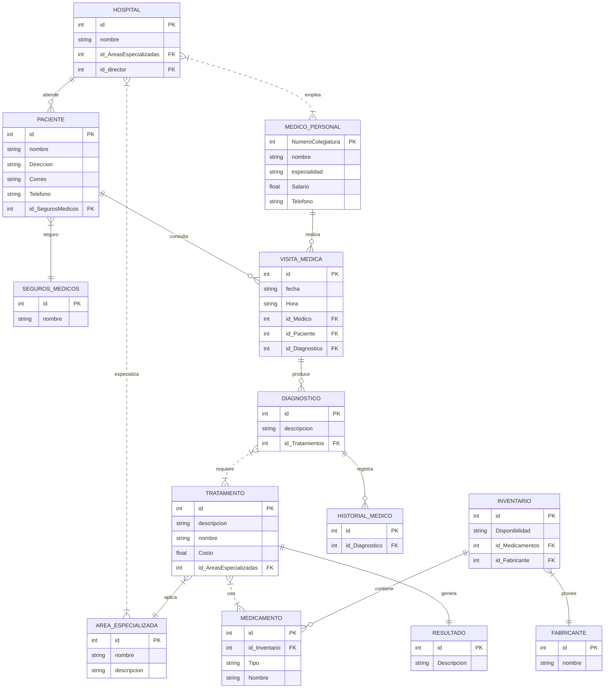

<h3 align="center";>

**SISTEMA HOSPITALARIO**

</h3>

<br>
<br>
<br>

<h3 align="center";>

**Maria Juliana Saavedra Mejia**

</h3>

<h3 align="center";>

**Juan David Santoyo Jaimes**

</h3>

<br>
<br>
<br>
<br>

<h3 align="center";>

**S1**

</h3>

<h3 align="center";>

**Pedro Felipe Gómez Bonilla**

</h3>

<br>
<br>
<br>
<br>

<h3 align="center";>

**CAMPUSLANDS**

</h3>

<h3 align="center";>

**RUTA NODE**

</h3>

<h3 align="center";>

**BUCARAMANGA, SANTANDER**

</h3>

<h3 align="center";>

**2025**

</h3>

---
<h1 align="center";>

## Introducción

</h1>

Este documento servirá como una guía detallada del proceso completo de diseño,
estructuración e implementación de una base de datos para un Sistema Hospitalario de la Secretaría de salud de Bucaramanga. El objetivo principal es gestionar eficazmente los datos e información generados por los hospitales, pacientes, médicos, tratamientos, medicamentos, visitas médicas, historiales clínicos, áreas especializadas y personal administrativo. Inicialmente, se analizará el caso de estudio junto con sus requerimientos específicos. A partir de esta investigación, se procederá a desarrollar un modelo conceptual detallado donde se identificarán las entidades principales, sus atributos y las relaciones entre ellas. Este paso determina las bases para comprender la estructura esencial de la gestión del sistema hospitalario.

A continuación, se realizará la conversión del modelo conceptual al modelo lógico. Este último
ofrece una representación más precisa de cómo se organizará la información, facilitando una
Comprensión clara de la base de datos en desarrollo. Se aplicará el proceso de Normalización
hasta la tercera forma normal (3FN) para optimizar la organización de los datos, reduciendo
redundancias y eliminando dependencias transitivas.

Posteriormente, se llevará a cabo la conversión del modelo lógico al modelo físico, el cual
define la implementación real de entidades, atributos y relaciones, incorporando detalles
técnicos como los tipos de datos adecuados para cada elemento.

Finalmente, se detallarán algunos procedimientos, funciones, consultas y creación perfiles que
complementarán la funcionalidad del sistema de información desarrollado, asegurando así su
eficiencia y utilidad para el sistema hospitalario.

Con estos pasos y elementos, se garantiza una guía completa y efectiva para el diseño y
desarrollo de la base de datos necesaria para la gestión eficiente del sistema hospitalario.


---
<h1 align="center";>

## Caso de Estudio

</h1>


La Secretaria de Salud ha pedido la creación de un diseño inicial de un software que permita manejar los datos e información que se generan sobre los Hospitales de la ciudad de Bucaramanga. Por lo que comenzamos estructurando los requerimientos dados:

- **Hospitales**

    - Un hospital puede tener múltiples áreas especializadas (Cardiología, Neurología, etc.).

    - Cada hospital tiene un director general, pero un director puede supervisar varios hospitales.
    - Cada hospital tiene un conjunto de médicos, enfermeras y personal administrativo.

    - Los hospitales deben contar con un historial detallado de pacientes y tratamientos realizados.

- **Pacientes**

    - Los pacientes se identifican por su número de historia clínica, nombre, dirección, teléfono, correo electrónico y seguros médicos.

    - Los historiales médicos incluyen diagnósticos, tratamientos realizados y resultados obtenidos.

- **Médicos y Personal**

    - Los médicos se identifican por su número de colegiatura, nombre, especialidad, teléfono, correo electrónico y salario.

    - Se definen los siguientes tipos de personal:

        - **001: Director General:** Gestión general del hospital.

        - **002: Médico Especialista:** Atiende pacientes y realiza diagnósticos.

        - **003: Enfermero/a:** Asiste a médicos y cuida a los pacientes.

        - **004: Personal Administrativo:** Gestión de recursos y logística.

        - **005: Personal de Mantenimiento:** Mantenimiento y limpieza de las instalaciones.

- **Tratamientos y Medicamentos**

    - Los tratamientos se identifican por su nombre, descripción, área médica relacionada y costo. 

    - Los medicamentos se almacenan por nombre, fabricante, tipo, y disponibilidad en inventario.

- **Visitas Médicas**

    - Las visitas médicas se registran con fecha, hora, médico asignado, paciente atendido y diagnóstico.

    - Los pacientes pueden tener múltiples visitas médicas a lo largo del tiempo.

Con base en la información anterior, se procederá a crear una base de datos en MongoDB con el objetivo de agrupar y relacionar los datos de los Hospitales de la ciudad de Bucaramanga, así como la información de los pacientes.

---
<h1 align="center";>

## Requisitos del Sistema

</h1>

Para ejecutar correctamente los scripts y configurar el sistema hospitalario, es necesario contar con el siguiente software instalado:

- MongoDB versión 4.x o superior

    -  Sitio oficial: https://www.mongodb.com/try/download/community

- MongoDB Compass (opcional, para visualización gráfica de datos)

    - Sitio oficial: https://www.mongodb.com/products/compass

- Git (para clonar el repositorio desde GitHub)

    - Sitio oficial: 
    https://github.com/Maria-Juliana-Saavedra-Mejia/Proyecto_MongoDB_S1_SaavedraMaria_SantoyoJuan

---

<h1 align="center";>

## Instalación y Configuración 

</h1>

Los archivos relacionados con la BBDD de la Secretaria de Salud , se encuentran en la
plataforma Github, estos archivos se encuentran en formato json y se dividen en 6 partes:

- ddl.json: Este archivo contiene el script para crear la base de datos y definir las colecciones correspondientes.

- dml.json: Este archivo contiene ejemplos de datos para gestionar los Hospitales, facilitando la inserción inicial de información.

- dql_select.json: En este archivo se encuentran las consultas relacionadas con pacientes, médicos, tratamientos, medicamentos, visitas médicas, historiales clínicos, áreas especializadas y personal administrativo.

- dql_funciones.json: Se definen los procedimientos y funciones para añadir, actualizar y mostrar datos dentro del sistema.

- Readme.md : Contiene toda la documentacion del proyecto. 

- Diagrama.jpg: En ese archivo se muestran los diagramas realizados. 

---

<h1 align="center";>

## Planificación 

</h1>

## Ejecución 

Una vez se analizó la información requerida por La Secretaria de Salud, se inició la creación del modelo conceptual. Este modelo proporciona una descripción de alto nivel de las necesidades de información que están detrás del diseño de una base de datos. Representa los conceptos principales de la base de datos y las relaciones entre ellos.

---


## Construcción del Modelo Conceptual

En esta sección del documento se adjunta la información correspondiente al modelo
conceptual el cual es el más abstracto de todos los modelos a implementar en el documento,
este es fundamental para identificar entidades clave del negocio y del sistema, así como para
establecer relaciones entre ellas.


**Descripción**

Se diseñó el modelo conceptual identificando cada una de las entidades, sus atributos y las
relaciones entre ellas. Este modelo conceptual proporciona una visión clara y estructurada de
cómo se organizan y conectan los diferentes elementos de la base de datos.

- **Las Entidades y Atributos**

1. Hospital

    - id: identificador único del hospital.
    - nombre: nombre del hospital.
    - id_AreasEspecializadas: Areas en las que se especializa
    - id_director: departamento correspondiente.

2. ÁreaEspecializada

    - id: identificador del área especializada.
    - nombre: nombre del área.
    - descripcion: descripción del área.

3. MédicoPersonal

    - NumeroColegiatura: identificador único del médico o personal.
    - nombre: nombre completo.
    - especialidad: especialidad médica.
    - Salario: Cantidad de dinero que gana mensualmente.
    - Teléfono: Numero de teléfono.

4. Paciente

    - id: identificador único del paciente.
    - nombre: nombre del paciente.
    - Dirección: Dirección.
    - Correo: correo electronico.
    - teléfono: teléfono de contacto.
    - id_SegurosMedicos: identificador del seguro del paciente.

5. SegurosMedicos

    - id: identificador único.
    - nombre: nombre del responsable.

6. VisitaMedica

    - id: identificador de la visita médica.
    - fecha: fecha de la visita.
    - Hora: hora de la visita.
    - id_Medico: identificador único del medico.
    - id_Paciente: identificador único del paciente.
    - id_Diagnostico: identificador único del paciente.

7. Diagnostico

    - id: identificador del diagnóstico.
    - descripcion: descripción del diagnóstico.
    - id_Tratamientos: identificador único de tratamientos.

8. Tratamientos

    - id: identificador del tratamiento.
    - descripcion: detalle del tratamiento.
    - nombre: duración estimada o real.
    - Costo: valor del tratamiento.
    - id_AreasEspecializadas: identificador del area del hospital que realiza este tratamiento.

9. Medicamentos

    - id: identificador del medicamento.
    - id_Inventario: Identificador del medicamento dentro del inventario.
    - Tipo: tipo de medicamento.
    - Nombre: nombre medicamento.

10. Inventario

    - id: identificador del inventario.
    - Disponibilidad: Cantidad de medicamentos en stock.
    - id_Medicamentos: identificador unico de los medicamentos dentro del inventario.
    - id_Fabricante:identificador unico de los fabricantes de los medicamentos.

11. Fabricante

    - id: identificador del fabricante.
nombre: nombre del fabricante.

12. Resultado

    - id: identificador del resultado.
    - Descripcion: descripcion del resultado obtenido en el tratamiento.

13. HistorialMedico

    - id: identificador HistorialMedico.
    - id_Diagnostico: nombre de la entidad.

- **Relaciones y Cardinalidades**

1. Hospital – MédicoPersonal

Cardinalidad:

Un hospital tiene uno o muchos médicos.
Un médico trabaja en muchos hospitales.
(N:M)

2. Hospital – ÁreaEspecializada

Cardinalidad:

Un hospital tiene una o varias áreas especializadas.
Un área especializada pertenece a un muchos hospitales.
(N:M)

3. Hospital – Paciente

Cardinalidad:

Un hospital atiende a uno o varios pacientes.
Un paciente es atendido por un solo hospital.
(1:N)

4. Paciente – SegurosMedicos

Cardinalidad:

Un paciente tiene un solo seguro médico.
Un seguro médico puede estar asociado a varios pacientes.
(N:1)

5. Paciente – VisitaMedica

Cardinalidad:

Un paciente puede tener muchas visitas médicas.
Cada visita médica está asociada a un solo paciente.
(1:N)

6. MédicoPersonal – VisitaMedica

Cardinalidad:

Un médico puede realizar muchas visitas médicas.
Cada visita médica es atendida por un solo médico.
(1:N)

7. VisitaMedica – Diagnóstico

Cardinalidad:

Una visita médica puede generar uno o varios diagnósticos.
Cada diagnóstico proviene de una única visita médica.
(1:N)

8. Diagnóstico – Tratamientos

Cardinalidad:

Un diagnóstico puede requerir varios tratamientos.
Un tratamiento puede ser aplicado a varios diagnósticos.
(N:M)

9. Tratamiento – ÁreaEspecializada

Cardinalidad:

Un tratamiento es aplicado por una sola área especializada.
Un área especializada puede realizar varios tratamientos.
(1:N)

10. Tratamiento – Medicamentos

Cardinalidad:

Un tratamiento puede usar varios medicamentos.
Un medicamento puede usarse en varios tratamientos.
(N:M)

11. Medicamento – Inventario

Cardinalidad:

Un medicamento está en un inventario.
Un inventario puede contener muchos medicamentos.
(1:N)

12. Inventario – Fabricante

Cardinalidad:

Un fabricante puede proveer muchos medicamentos al inventario.
Un inventario puede registrar medicamentos de un solo fabricante.
(1:N)

13. Tratamiento – Resultado

Cardinalidad:

Un tratamiento puede generar un resultado.
Un resultado está ligado a un tratamiento.
(1:1)

14. Diagnóstico – HistorialMedico

Cardinalidad:

Un diagnóstico forma parte del historial médico.
Un historial médico puede contener muchos diagnósticos.
(1:N)

**Diagrama** 


## Construcción del Modelo Lógico

En esta sección del documento se adjunta la información correspondiente al modelo lógico el
cual es el representa la estructura de los datos sin detalles de implementación física,
enfocándose en las entidades, atributos, relaciones y claves de la base de datos.Este modelo
ayuda a comprender la organización de los datos y sus interconexiones, permitiendo la
normalización y la especificación de claves principales y externas.


**Descripción**

- **Las Entidades y Atributos**

1. Hospital 
    - id: INT PRIMARY KEY.
    - id_director: INT NOT NULL FOREING KEY.
    - id_AreasEspecializadas: INT NOT NULL FOREING KEY.
    - nombre: String (100) NOT NULL.

2. AreasEspecializadas
   - id: INT PRIMARY KEY.
   - nombre: String (100) NOT NULL.
   - descripcion: String (500) NOT NULL.

3. Medico_Personal 
    - NumeroColegiatura: INT PRIMARY KEY.
    - nombre: String (100) NOT NULL.
    - especialidad: String (100) NOT NULL.
    - salario: Double NOT NULL.
    - telefono: String (25) NOT NULL.

4. Paciente
    - id: INT PRIMARY KEY.
    - nombre: String (100) NOT NULL.
    - direccion: String (100) NOT NULL.
    - correo: String (100) NOT NULL.
    - telefono: String (25) NOT NULL
    - id_SegurosMedicos: INT NOT NULL FOREING KEY.


5. SegurosMedicos
    - id: INT PRIMARY KEY.
    - nombre: String (100) NOT NULL.

6. HistorialMedico
    - id: INT PRIMARY KEY.
    - id_Diagnostico: INT NOT NULL FOREING KEY.

7. VisitasMedicas
    - id: INT PRIMARY KEY.
    - fecha: Date NOT NULL.
    - id_Medico: INT NOT NULL FOREING KEY.
    - id_Paciente: INT NOT NULL FOREING KEY.
    - id_Diagnostico: INT NOT NULL FOREING KEY.

8. Diagnosticos
    - id: INT PRIMARY KEY.
    - descripcion: String (500) NOT NULL.
    - id_Tratamientos: INT NOT NULL FOREING KEY.

9. Tratamientos
    - id: INT PRIMARY KEY.
    - descripcion: String (500) NOT NULL.
    - nombre: String (100) NOT NULL.
    - Costo: Double NOT NULL.
    - id_AreasEspecializadas: INT NOT NULL FOREING KEY.

10. Resultados
    - id: INT PRIMARY KEY.
    - descripcion: String (500) NOT NULL.

11. Medicamentos
    - id: INT PRIMARY KEY.
    - id_Inventario: INT NOT NULL FOREING KEY.
    - tipo: String (100) NOT NULL.
    - nombre: String (100) NOT NULL.

12. Inventario
    - id: INT PRIMARY KEY.
    - Disponibilidad: INT NOT NULL.
    - id_Medicamentos: INT NOT NULL FOREING KEY.
    - id_Fabricante: INT NOT NULL FOREING KEY.

13. Fabricante
    - id: INT PRIMARY KEY.
    - nombre: String (100) NOT NULL.

- **Relaciones y Cardinalidades**

1. Hospital - Médico Personal:

    - Un hospital puede emplear a varios médicos, y un médico puede trabajar en varios hospitales.

    - Relación N:M (muchos a muchos)

2. Hospital - Área Especializada:

    - Un hospital puede tener varias áreas especializadas, y una misma área puede estar presente en varios hospitales.

    - Relación N:M (muchos a muchos)

3. Hospital - Paciente:

    - Un hospital atiende a muchos pacientes, pero un paciente solo es atendido en un hospital.

    - Relación 1:N (uno a muchos)

4. Paciente - Seguros Médicos:

    - Cada paciente tiene un solo seguro médico, pero un seguro médico puede ser compartido por varios pacientes.

    - Relación N:1 (muchos a uno)

5. Paciente - Visita Médica:

    - Un paciente puede tener múltiples visitas médicas, pero cada visita médica está asociada a un solo paciente.

    - Relación 1:N (uno a muchos)

6. Médico Personal - Visita Médica:

    - Un médico puede realizar muchas visitas médicas, pero cada visita médica es realizada por un único médico.

    - Relación 1:N (uno a muchos)

7. Visita Médica - Diagnóstico:

    - Una visita médica puede generar varios diagnósticos, pero cada diagnóstico está ligado a una única visita.

    - Relación 1:N (uno a muchos)

8. Diagnóstico - Tratamiento:

    - Un diagnóstico puede requerir varios tratamientos, y un tratamiento puede ser usado en distintos diagnósticos.

    - Relación N:M (muchos a muchos)

9. Tratamiento - Área Especializada:

    - Un tratamiento se aplica en una única área especializada, pero una misma área puede aplicar varios tratamientos.

    - Relación N:1 (muchos a uno)

10. Tratamiento - Medicamento:

    - Un tratamiento puede usar varios medicamentos, y un medicamento puede ser usado en múltiples tratamientos.

    - Relación N:M (muchos a muchos)

11. Inventario - Medicamento:

    - Un inventario puede contener varios medicamentos, pero un medicamento está en un solo inventario.

    - Relación 1:N (uno a muchos)

12. Inventario - Fabricante:

    - Cada inventario está abastecido por un fabricante, pero un fabricante puede proveer varios inventarios.

    - Relación N:1 (muchos a uno)

13. Tratamiento - Resultado:

    - Cada tratamiento genera un único resultado, y un resultado es generado por un único tratamiento.

    - Relación 1:1 (uno a uno)

14. Diagnóstico - Historial Médico:

    - Un diagnóstico puede registrarse en varios historiales médicos, pero un historial médico solo tiene un diagnóstico.

    - Relación 1:N (uno a muchos)


**Diagrama**


## Normalización del Modelo Lógico

En esta sección del documento se adjunta la normalización realizada al modelo lógico, es un
proceso para organizar los datos de forma eficiente y coherente, eliminando la redundancia y
las inconsistencias. Este proceso se enfoca en estructurar las tablas de la base de datos
según reglas específicas, conocidas como formas normales, para mejorar la integridad de los
datos y facilitar su manipulación.

## Primera Forma Normal (1FN)

En esta sección del documento se adjunta la información correspondiente a la primera forma
de normalización que implica que cada celda de una tabla contenga un único valor atómico, es
decir, que no pueda ser dividido en partes más pequeñas. Además, la tabla debe tener una
clave primaria única que identifique cada fila de forma inequívoca.

**Descripción**


**Diagrama**


## Segunda Forma Normal (2FN)

En esta sección del documento se adjunta la información correspondiente a la Segunda Forma
Normal (2FN), un paso crucial en el proceso de normalización de bases de datos. La 2FN se
enfoca en resolver un problema específico que puede surgir cuando se trabaja con claves
primarias compuestas, es decir, cuando una clave primaria está formada por dos o más
atributos. El objetivo principal de esta segunda forma es eliminar las dependencias parciales
entre los atributos no clave y la clave primaria.

**Descripción**


**Diagrama**


## Tercera Forma Normal (3FN)

En esta sección del documento se adjunta la información correspondiente a la Tercera Forma
Normal (3FN), un paso crucial en el proceso de normalización de bases de datos. Su objetivo
principal es eliminar las dependencias transitivas, lo que significa que ningún atributo no clave
puede depender directamente de la clave primaria a través de otro atributo no clave. Esto
garantiza que cada columna no clave esté directamente vinculada a la clave primaria y nada
más.

**Descripción**


**Diagrama**


## Análisis del Modelo Original

**Problemas Identificados:**

- **Hospital:** `id_AreasEspecializadas` como campo simple no puede manejar múltiples áreas.
- **Paciente:** Atributo "dirección" duplicado.
- **VisitaMedica:** `id_Diagnostico` singular cuando puede haber múltiples diagnósticos.
- **Diagnostico:** `id_Tratamientos` singular para relación N:M.
- **Medicamentos/Inventario:** Referencias circulares confusas.
- **HistorialMedico:** Estructura incompleta.

---

## Primera Forma Normal (1FN) en MongoDB

**Objetivo:** Estructurar documentos de forma coherente, eliminar duplicaciones y organizar relaciones apropiadamente.

### Cambio 1: Hospital - Manejo de Múltiples Áreas

❌ **ANTES:**

```javascript
Hospital: {
    _id: ObjectId,
    nombre: String,
    id_AreasEspecializadas: ObjectId,  // Solo una área
    id_director: ObjectId
}

✅ **DESPUÉS (1FN):**

```javascript
Hospital: {
    _id: ObjectId("64a1b2c3d4e5f6789012345a"),
    nombre: "Hospital San Juan",
    areasEspecializadas: [
        ObjectId("64a1b2c3d4e5f6789012345b"),
        ObjectId("64a1b2c3d4e5f6789012345c"),
        ObjectId("64a1b2c3d4e5f6789012345d")
    ],
    director: ObjectId("64a1b2c3d4e5f6789012345e")
}
```

### Cambio 2: Paciente - Eliminación de Duplicación

❌ **ANTES:**

```javascript
Paciente: {
    _id: ObjectId,
    nombre: String,
    Dirección: String,  // Duplicado
    Correo: String,
    dirección: String,  // Duplicado
    teléfono: String,
    id_SegurosMedicos: ObjectId
}
```

✅ **DESPUÉS (1FN):**

```javascript
Paciente: {
    _id: ObjectId("64a1b2c3d4e5f6789012346a"),
    nombre: "María González",
    direccion: "Carrera 15 #32-45, Bogotá",
    correo: "maria.gonzalez@email.com",
    telefono: "+57 300 123 4567",
    seguroMedico: ObjectId("64a1b2c3d4e5f6789012346b"),
    hospital: ObjectId("64a1b2c3d4e5f6789012345a")
}
```

### Cambio 3: Visita Médica - Múltiples Diagnósticos

❌ **ANTES:**

```javascript
VisitaMedica: {
    _id: ObjectId,
    fecha: Date,
    Hora: String,
    id_Medico: ObjectId,
    id_Paciente: ObjectId,
    id_Diagnostico: ObjectId
}
```

✅ **DESPUÉS (1FN):**

```javascript
VisitaMedica: {
    _id: ObjectId("64a1b2c3d4e5f6789012347a"),
    fecha: ISODate("2025-01-15T09:00:00Z"),
    hora: "09:00",
    medico: ObjectId("64a1b2c3d4e5f6789012347b"),
    paciente: ObjectId("64a1b2c3d4e5f6789012346a"),
    diagnosticos: [
        ObjectId("64a1b2c3d4e5f6789012347c"),
        ObjectId("64a1b2c3d4e5f6789012347d")
    ]
}
```

### Cambio 4: Diagnóstico - Múltiples Tratamientos

❌ **ANTES:**

```javascript
Diagnostico: {
    _id: ObjectId,
    descripcion: String,
    id_Tratamientos: ObjectId
}
```

✅ **DESPUÉS (1FN):**

```javascript
Diagnostico: {
    _id: ObjectId("64a1b2c3d4e5f6789012347c"),
    descripcion: "Hipertensión arterial",
    visitaMedica: ObjectId("64a1b2c3d4e5f6789012347a"),
    tratamientos: [
        ObjectId("64a1b2c3d4e5f6789012348a"),
        ObjectId("64a1b2c3d4e5f6789012348b")
    ]
}
```

---

## Segunda Forma Normal (2FN) en MongoDB

En MongoDB, 2FN se enfoca en evitar dependencias parciales en documentos embebidos complejos. Todas las colecciones principales mantienen dependencias funcionales completas.

---

## Tercera Forma Normal (3FN) en MongoDB

**Objetivo:** Eliminar dependencias transitivas reorganizando referencias.

### Cambio Principal: Medicamentos - Inventario - Fabricante

❌ **ANTES (Dependencia Transitiva):**

```javascript
Medicamentos: {
    _id: ObjectId,
    id_Inventario: ObjectId,
    Tipo: String,
    Nombre: String
}

Inventario: {
    _id: ObjectId,
    Disponibilidad: Number,
    id_Medicamentos: ObjectId,
    id_Fabricante: ObjectId
}
```

✅ **DESPUÉS (3FN):**

```javascript
Medicamentos: {
    _id: ObjectId("64a1b2c3d4e5f6789012349a"),
    tipo: "Antihipertensivo",
    nombre: "Losartán 50mg",
    fabricante: ObjectId("64a1b2c3d4e5f6789012349b"),
    inventario: {
        disponibilidad: 150,
        ubicacion: "Estante A-12",
        fechaIngreso: ISODate("2025-01-10T00:00:00Z")
    }
}

Fabricante: {
    _id: ObjectId("64a1b2c3d4e5f6789012349b"),
    nombre: "Laboratorios ABC S.A."
}
```

---

## Esquema Final Normalizado MongoDB

```javascript
// hospitals
{
    _id, nombre, director, areasEspecializadas: [ObjectId], medicos: [ObjectId]
}

// areasEspecializadas
{ _id, nombre, descripcion }

// medicoPersonal
{ _id, numeroColegiatura, nombre, especialidad, salario, telefono, hospitales: [ObjectId] }

// pacientes
{ _id, nombre, direccion, correo, telefono, seguroMedico, hospital, historialMedico }

// segurosMedicos
{ _id, nombre }

// visitasMedicas
{ _id, fecha, hora, medico, paciente, diagnosticos: [ObjectId] }

// diagnosticos
{ _id, descripcion, visitaMedica, tratamientos: [ObjectId] }

// tratamientos
{
    _id, descripcion, nombre, costo, areaEspecializada, medicamentos: [ObjectId],
    resultado: { _id, descripcion, fecha }
}

// medicamentos
{
    _id, tipo, nombre, fabricante,
    inventario: { disponibilidad, ubicacion, fechaIngreso, fechaVencimiento }
}

// fabricantes
{ _id, nombre }

// historialMedico
{ _id, paciente, diagnosticos: [ObjectId], fechaCreacion, ultimaActualizacion }
```

## Beneficios de la Normalización MongoDB

✅ Eliminación de duplicación: campo direccion unificado en pacientes

✅ Relaciones N\:M correctas: arrays de ObjectIds para múltiples referencias

✅ Referencias limpias: sin dependencias circulares entre medicamentos e inventario

✅ Estructura coherente: documentos bien organizados y consistentes

✅ Flexibilidad: fácil consultar y actualizar información relacionada

✅ Performance optimizada: datos relacionados agrupados eficientemente

✅ Escalabilidad: estructura preparada para crecimiento del sistema

✅ Integridad: relaciones correctamente modeladas según cardinalidades

```
